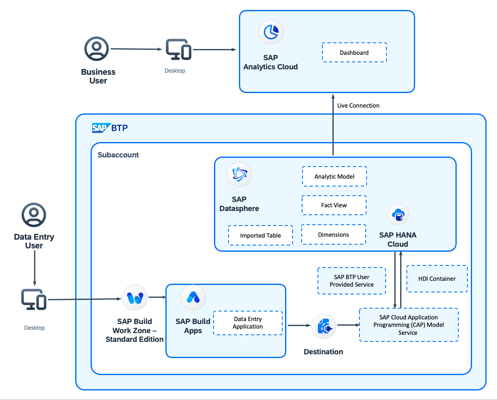

# Enable End-User Data Entry into SAP Datasphere via SAP Build Apps

This tutorial shows how end users can add data directly into SAP Datasphere to enable additional business scenarios and to support process optimizations. Learn how to create insightful dashboards that help you improve your business decisions. You will utilize the flexibility of SAP Build Apps as a channel to enter data.

You can find this scenario as a mission in [SAP Discovery Center](). //TODO

## Business Scenario

To illustrate this use case, the following concrete sample scenario is used throughout the tutorial. You can take this scenario as a source of inspiration and adapt it according to your business needs:

Imagine a tank farm in the midstream oil and gas industry. Monitoring the product level in each tank assists the owners in understanding if they can fulfil their product orders at a given time. While some tanks leverage IoT sensors for automated level monitoring, others scattered across the field need manual readings by a field technician.

This scenario covers:

* Build a front-end application for end-user data collection using SAP Build Apps.
* Implement a simple service in SAP Business Technology Platform (SAP BTP) to connect the SAP Build Apps application with SAP Datasphere.
* Perform analytical data modelling within SAP Datasphere.
* Design a comprehensive dashboard using SAP Analytics Cloud tooling.

## Solution Architecture

 
 
## Requirements

You can find all requirements to execute the tutorial in the [Prerequisites](/documentation/set-up/mission-prerequisites/README.md) section.

## Tutorial

### Discover

 * [Learn how to use missions and project boards in SAP Discovery Center](./documentation/discover/how-to-use-missions)
 * [Learn about the goal and outcome of the mission](./documentation/discover/goal-and-outcome-of-mission)
 * [Learn the basics of SAP BTP](./documentation/discover/sap-btp-basics)
 * [Learn about SAP Datasphere](./documentation/discover/sap-datasphere)
 * [Learn about SAP Build Apps](./documentation/discover/sap-build-apps)
 * [Discover the Cloud Application Programming Model (CAP)](./documentation/discover/discover-cap)
 * [Learn About SAP Analytics Cloud](./documentation/discover/sap-analytics-cloud)

   
### Set-up

  * [Prerequisites](/documentation//set-up/mission-prerequisites/README.md)
  * [Configure your global account and subaccount in SAP BTP](./documentation/set-up/configure-account)
  * [Set up SAP Business Application Studio](./documentation/set-up/set-up-business-application-studio)
  * [Set up SAP Build Apps](./documentation/set-up/set-up-build-apps)
  * [Set up SAP Build Work Zone, standard edition](./documentation/set-up/set-up-build-work-zone)
  * [Set up SAP Datasphere](./documentation/set-up/set-up-datasphere)
  * [Set up SAP Analytics Cloud](./documentation/set-up/set-up-sac)

### Develop

  * [Create Master Table in SAP Datasphere](./documentation/develop/create-master-table)
  * [Create SAP BTP User-Provided Service](./documentation/develop/create-user-provided-service)
  * [Create CAP Application](./documentation/develop/create-cap-application)  
  * [Deploy CAP Application](./documentation/develop/deploy-cap-application)
  * [Create BTP Destinations](./documentation/develop/create-btp-destination)
  * [Create SAP Build Apps Application](./documentation/develop/create-build-apps-app)
  * [Deploy SAP Build Apps Application](./documentation/develop/deploy-build-apps-app)
  * [Create Analytic Model in SAP Datasphere](./documentation/develop/create-analytic-model)
  * [Create SAC Dashboard](./documentation/develop/create-sac-dashboard)
  * [Create SAP Build Work Zone Site](./documentation/develop/create-work-zone-site)

### Complete

   * [Tell us what do you think](./documentation/complete/give-feedback)
   * [Explore similar missions](./documentation/complete/explore-similar-missions)
   * [Complete the mission](./documentation/complete/complete-mission)

## How to Obtain Support

[Create an issue]() in this repository if you find a bug or have questions about the content. //ToDo

For additional support, [ask a question in SAP Community](https://answers.sap.com/questions/ask.html).

## Contributing

If you wish to contribute code, offer fixes or improvements, please send a pull request. Due to legal reasons, contributors will be asked to accept a DCO when they create the first pull request to this project. This happens in an automated fashion during the submission process. SAP uses [the standard DCO text of the Linux Foundation](https://developercertificate.org/).

## License

Copyright (c) 2023 SAP SE or an SAP affiliate company. All rights reserved. This project is licensed under the Apache Software License, version 2.0 except as noted otherwise in the [LICENSE](LICENSE) file.
