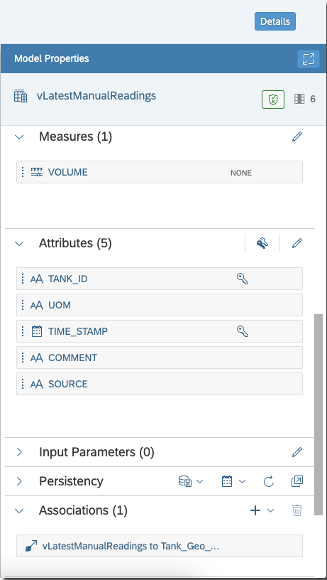
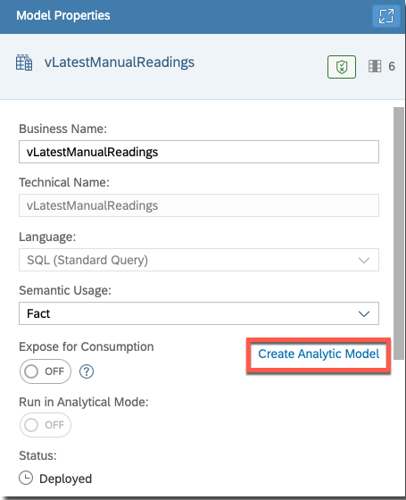

# Create SAP Datasphere Analytic Model

Analytic models are the analytical foundation for making data ready for consumption in SAP Analytics Cloud. 

The SAP Analytics Cloud dashboard aims to visualize essential details of tanks, such as their size and location, along with the most recent volume readings. To achieve this, an analytic model will be developed in this section using transaction data entered through the SAP Build Apps application, along with the Tank geographical location details.

See [Creating an Analytic Model](https://help.sap.com/docs/SAP_DATASPHERE/c8a54ee704e94e15926551293243fd1d/e5fbe9e2cb93484dab8b1963145e565f.html?locale=en-US)

## Add HDI Container into the Space

The data from SAP Build Apps application can be accessed via HDI schema which has been deployed using the CAP application. To do so, you will need to add the HDI schema to your SAP Datasphere Space.

1. Open SAP Datasphere.
2. In the side navigation area, choose **Space Management**, locate your space (for example, Tank Farm), and choose **Edit**.
3. In the HDI Container section, choose the + button to open the **Add Unassigned HDI Containers** dialog.
4. Select your [hdi schema](../create-cap-application/README.md#hdi-artifacts) (**DWC_HDI**) which was specified in the mta.yaml file and choose **Add**.
5. Choose **Deploy**.

   

See [Add an HDI Container and Access its Objects in Your Space](https://help.sap.com/docs/SAP_DATASPHERE/be5967d099974c69b77f4549425ca4c0/5d55da5514b240ff8d3a970bf7dc6705.html?locale=en-US).

## Create Artifacts

Prepare the latest volume readings and combine them with the existing geographical location view to develop an analytic model.

Create the following artifacts using **Data Builder**:
    
* Graphical view from local table DWCMISSION_FARM_TANKVOLUMES_M which is created by CAP Service (vManualReadingsAll)
* SQL view only for the latest readings from DWCMISSION_FARM_TANKVOLUMES_M (vLatestManualReadings)
* Analytic model (AM_ManualTankDetailsAll)


### Graphical View (vManualReadingsAll)

1. In the side navigation area, choose **Data Builder**, and then choose your space if necessary.
2. Choose **New Graphical View** to open the editor.
3. Choose **Sources**.
4. Drag DWCMISSION_FARM_TANKVOLUMES_M from the HDI container which is added from the CAP application.
5. Choose **Import and Deploy**.

   
6. Choose the view and in the **Business Name** and **Technical Name** fields enter **vManualReadingsAll**.
7. Choose **Save** and **Deploy**.
8. [Optional] You can view the preloaded data by choosing the view **vManualReadingsAll** > **Data Viewer**.    

See [Creating a Graphical View](https://help.sap.com/docs/SAP_DATASPHERE/c8a54ee704e94e15926551293243fd1d/27efb479c4814252964d3fbc6ca2dfc3.html).

### SQL View (vLatestManualReadings)

Create an SQL view to have only the latest readings of the tanks along with the location details from **Tank_Geo_Dimension** by adding it as **Associations**.

1. In the side navigation area, choose **Data Builder**, and choose your space if necessary.
2. Choose **New SQL view** to open the editor.
3. Copy and paste the following SQL statements in the editor.

```
    SELECT "T1"."TANK_ID",
        "T1"."VOLUME",
        "T1"."UOM",
        "T1"."TIME_STAMP",
        "T1"."COMMENT",
        "T1"."SOURCE"
    FROM "DWCMISSION_FARM_TANKVOLUMES_M" "T1"
    WHERE "T1"."TIME_STAMP" >= (
            SELECT MAX("T3"."TIME_STAMP")
            FROM "DWCMISSION_FARM_TANKVOLUMES_M" "T3"
            WHERE "T3"."TANK_ID" = "T1"."TANK_ID"
        )
```
4. In the **Business Name** field, enter **vLatestManualReadings**.
5. In the **Semantic Usage** field, select **Fact**.
6. Choose **Format** and **Validate SQL** from the canvas menu.

   

7. In the **Measures** section, add **VOLUME** as a measure by draging the **VOLUME** from the **Attributes** section below.
8. Choose **SUM** from **VOLUME** measure and select **NONE**.
9. In the  **Attributes** section, select **TANK_ID**, choose **...**, and select **Set as Key**.
10. Similarly, set **TIME_STAMP** as key.

Here, the two columns are set as key.

11. Choose **Associations**, and then choose **+** > **Associations** to open the **Select Association Target** dialog.
12. Select the **Tank_Geo_Dimension** row from the list.
13. Choose **OK**.

The dimension **Tank_Geo_Dimension** is added as association to the SQL view to have location details.

14. Choose **Save** and **Deploy**.



15. [Optional] You can view the data from menu **View** > **Data Viewer**.

### Analytic Model (AM_ManualTankDetailsAll)

1. In the side navigation area, choose  **Data Builder**, and choose your space if necessary.
2. Choose the previously created **vLatestManualReadings** view.
3. In **Model Properties**, choose **Create Analytic Model**.



4. It will open a new analytic model.
5. In the **Name** field, enter **AM_ManualTankDetailsAll**.
6. Choose **Save** and **Deploy**.


Alternatively, you can create the same model, by choosing **New Analytic Model** from Data Builder, and add  **vLatestManualReadings** from sources to save and deploy.

See [Creating an Analytic Model](https://help.sap.com/docs/SAP_DATASPHERE/c8a54ee704e94e15926551293243fd1d/e5fbe9e2cb93484dab8b1963145e565f.html).

## Summary
 
You have successfully developed an analytic model that allows SAP Analytics Cloud to consume data and generate a comprehensive dashboard for data analysis.
