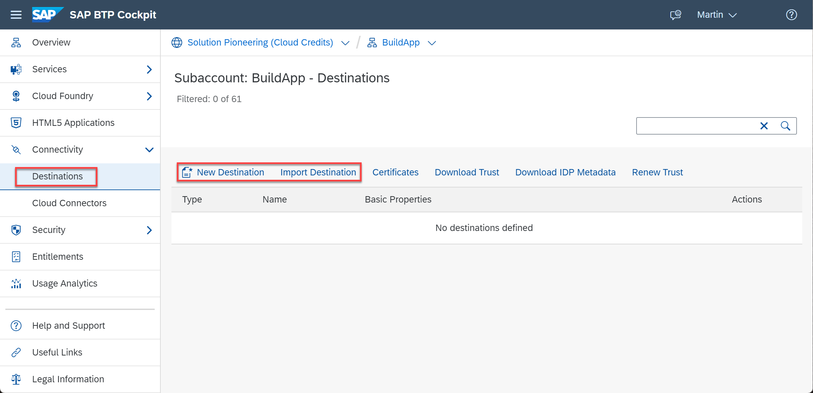
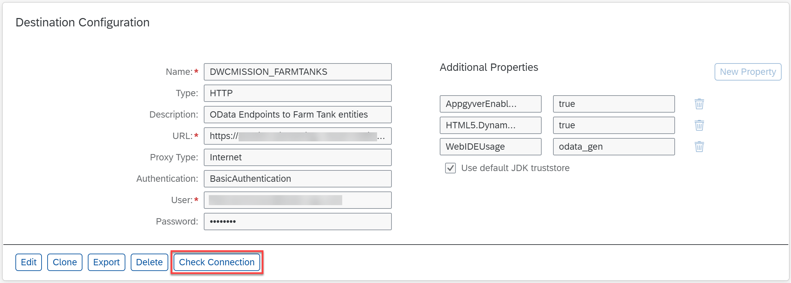
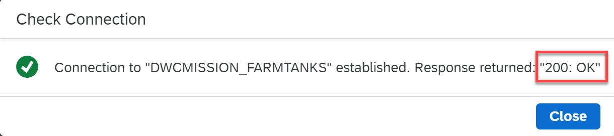

# Create a Destination in SAP BTP Cockpit

To enable your SAP Build Apps app to use the OData endpoints of your CAP application, you need a destination in the subaccount where you develop the application and also in the subaccount where you deploy the application.

1. In the SAP BTP cockpit, navigate to your subaccount.

2. In the left-side subaccount menu, navigate to **Connectivity** &rarr; **Destinations**.

   

3. Choose **New Destination** to create a new destination or you can choose **Import Destination** to import the sample destination file [DWCMISSION_FARMTANKS](./../../../code/Destination/DWCMISSION_FARMTANKS).

4. Configure the **Destination** by entering or adjusting the following values:

* **Name**: a meaningful name, for example **DWCMISSION_FARMTANKS**
* **Type**: **HTTP**
* **Description**: for example **OData Endpoints to Farm Tank entities**
* **URL**: the application route (obtained when [deploying the CAP application](./../deploy-cap-application/README.md)) followed by **/farm-tank**
* **ProxyType**: **Internet**
* **Authentication**: **BasicAuthentication**
* **User**: **field.technician@tester.sap.com**
* **Password**: the password you configured for your [OData endpoint](./../create-cap-application/README.md)

5. Add the following **Additional Properties** by choosing **New Property**. If you have imported the sample destination file, the following properties are automatically added:

* Name: **AppgyverEnabled** - value: **true**
* Name: **HTML5.DynamicDestination** - value: **true**
* Name: **WebIDEUsage** - value: **odata_gen**

6. Select the **Use default JDK truststore** checkbox.

7. Save your settings.
   
   

8. Choose **Check Connection**. You should get a **200 OK** response.
   
   

## Summary

You have created a destination in the subaccount in SAP BTP that can be used by SAP Build Apps to consume your OData service.
