# Create a Web Application Using SAP Build Apps

To allow you to focus on the key aspects of the integration, you will upload a project that is almost complete and you will configure the authentication and data integration. You will then preview the finished application and test that it is working as expected. Optionally, explore the implementation of the application.

## Open SAP Build Apps

Open the **SAP Build Apps** link if you have it already bookmarked. Otherwise, open it from the **SAP BTP cockpit**:

 1. Open the SAP BTP cockpit, and navigate to your subaccount.
 2. From the left-side of your subaccount menu, navigate to **Services** &rarr; **Instances and Subscriptions**.

 3. In the **Subscriptions** tab, find **SAP Build Apps** and choose **Go to Application**.

     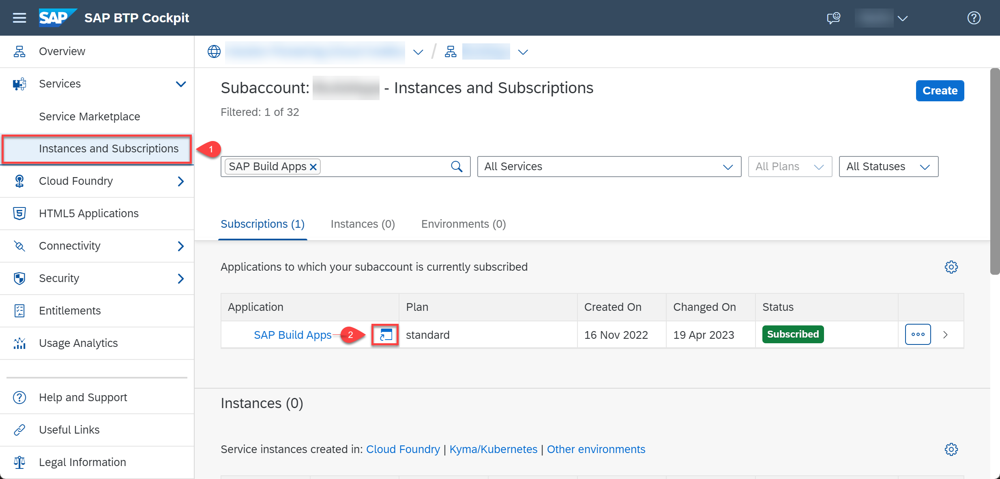

 4. If you are presented with a login screen, log in using your custom identity provider credentials.

Result: The **Lobby** of SAP Build Apps opens.

## Import a Project

1. [Download](./../../../code/BuildApps/Tank%20Volume%20Entry%20Template.mtar) the template file.

2. In the **Lobby**, choose **Import**.

3. Choose **Browse** and select the template file.

4. Choose **Import**.

   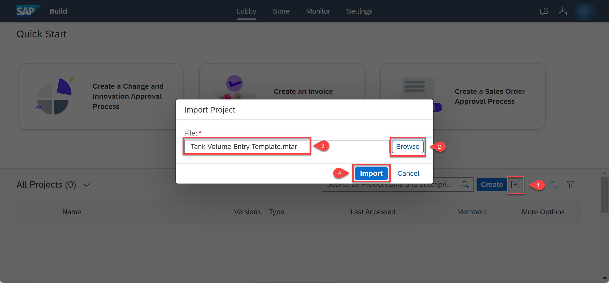

5. Select the project to open it in **App Builder** where you will finish configuring the application.

## Enable Authentication

To consume data from your SAP backend system, which you configured as a destination in SAP BTP in the previous section, you need to enable authentication.

1. Choose **AUTH** at the top section of SAP Build Apps.

2. Choose **Enable Authentication**.

   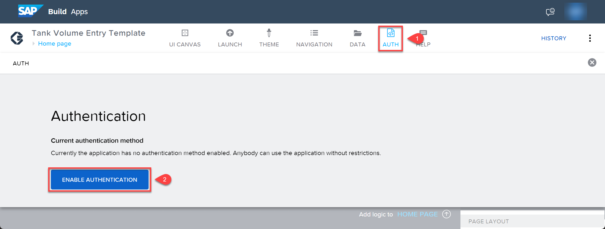

3. Select **SAP BTP Authentication** and choose **OK**. This enables authentication for the project.

   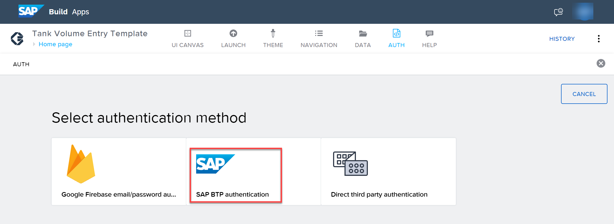

## Add a Data Source

To add a data source, you need to add the following steps to your project:

1. Choose the **DATA** tab at the top of SAP Build Apps.

2. Find the **No systems integrated** section and choose **Add Integration**.

   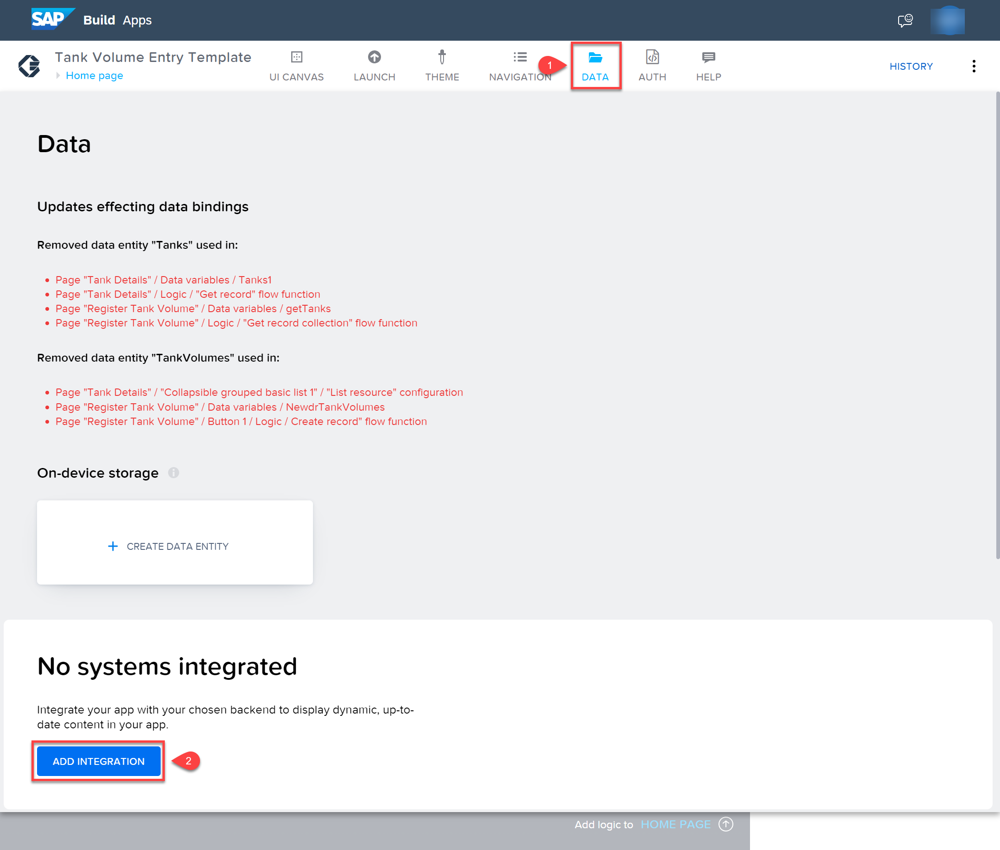

3. On the next screen under **SAP Systems**, select **BTP Destinations**.

   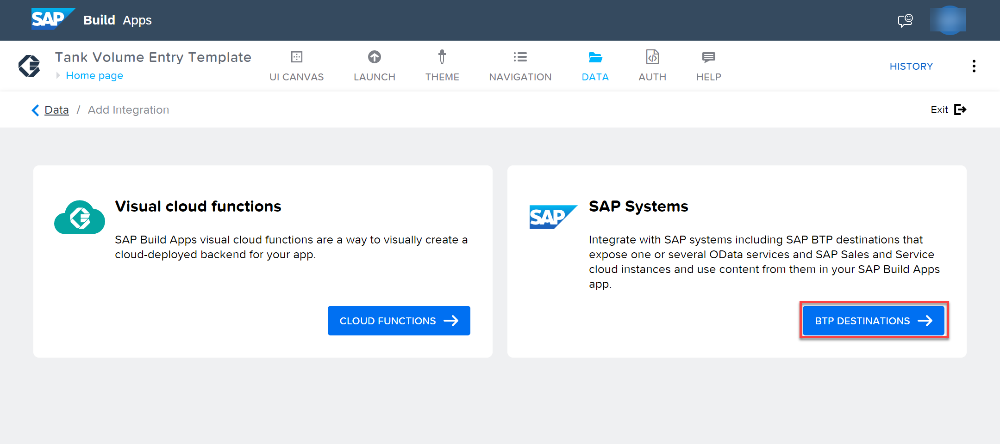

4. From the list of destinations, select the **DWCMISSION_FARMTANKS** destination that you have created earlier.

   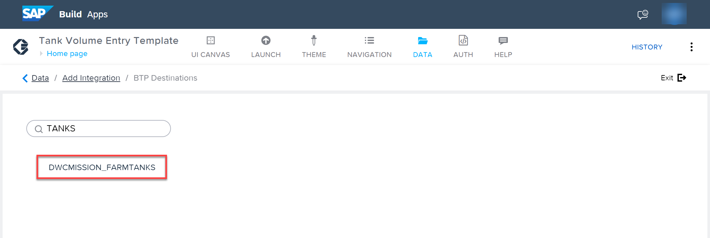

5. Choose **Install Integration**.

   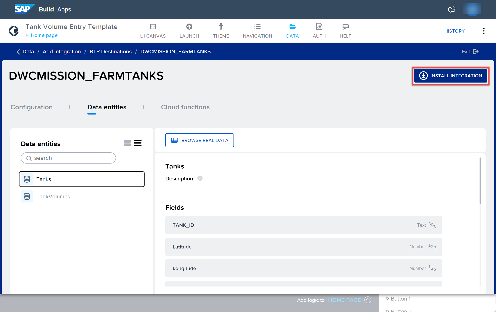

6. Under the **Data entities**, select **Tanks**, and then choose **Enable Data Entity**.

   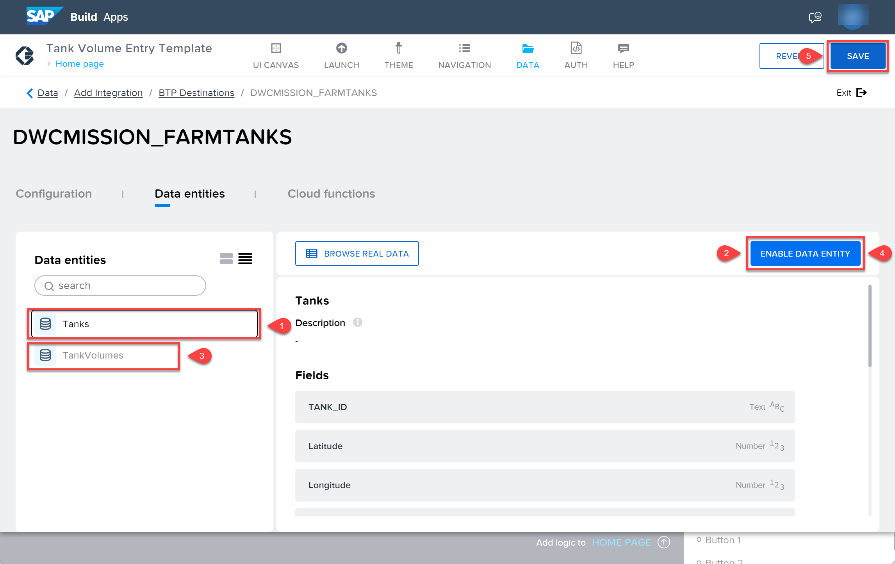

7. Select **TankVolumes**, and then choose **Enable Data Entity**.

8. Choose **SAVE** at top of the SAP Build Apps. This adds the data source to your project.

   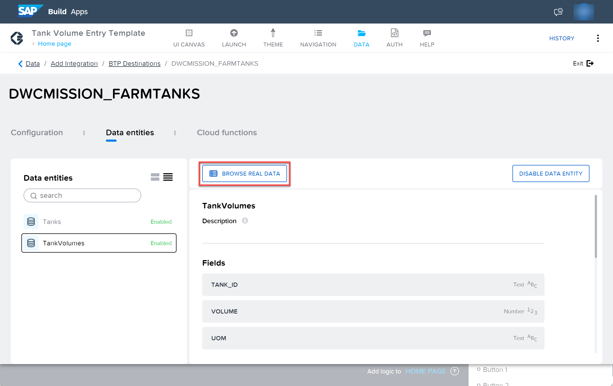

9. Choose **BROWSE REAL DATA** for each entity to see the data that you will be working with.

10. Choose **UI Canvas** to go back to the UI designer view.

## Preview the Application

If the application is behaving correctly, you can deploy it in the next step. Preview the application and test it.

1. Choose **LAUNCH**.

2. Choose **OPEN PREVIEW PORTAL**.

   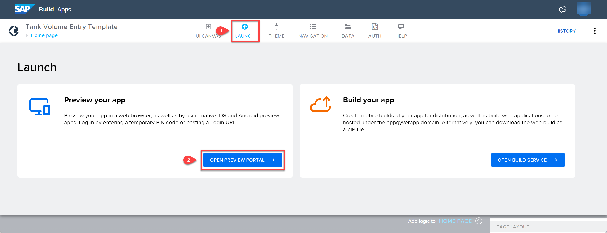

3. Choose **Open web preview**. 

   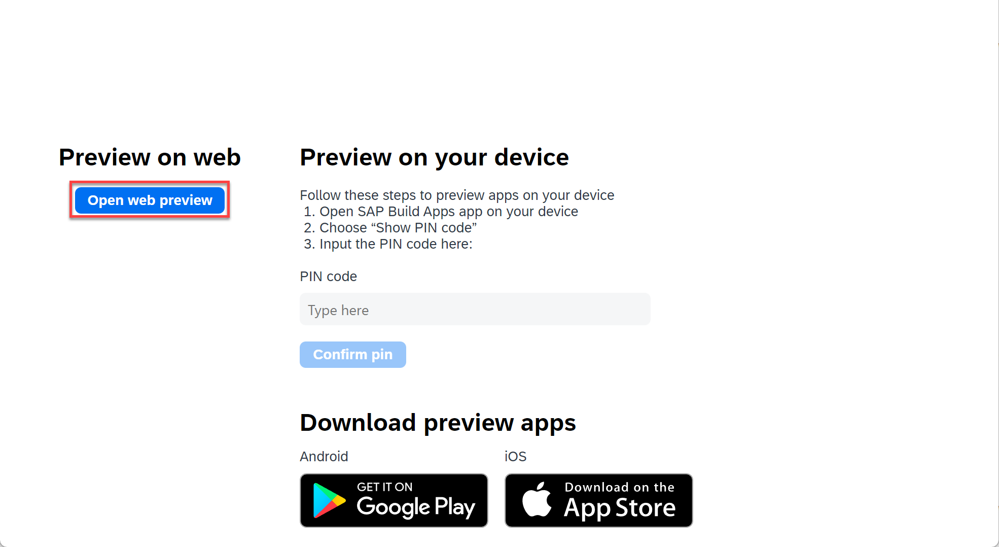

4. Select the application you have created.

   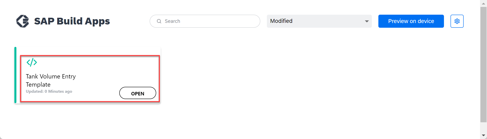

   The application is launched in the preview portal. Although it is a Web application, the UI is designed for mobile devices. You can get a better impression of how it would look on a phone or tablet if you resize your browser. In Chrome, for example, the Developer tools (F12) allows you to choose dimmensions corresponding to a specific device.

    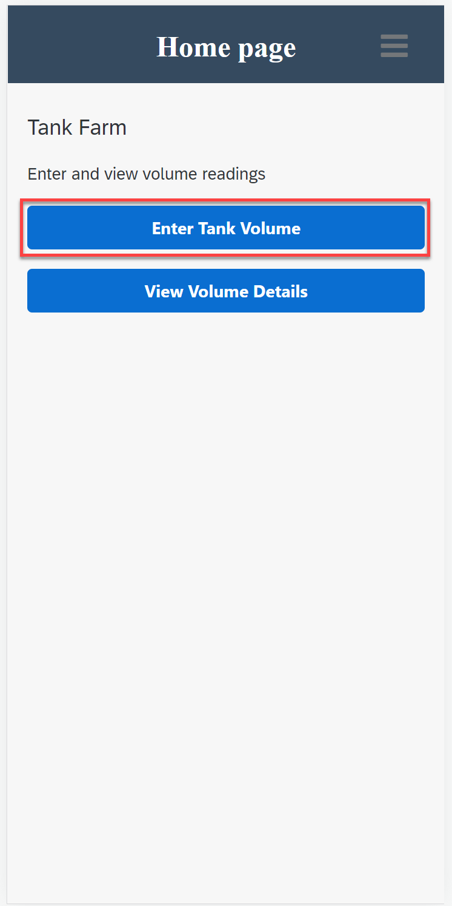

5. Choose **Enter Tank Volume**.

   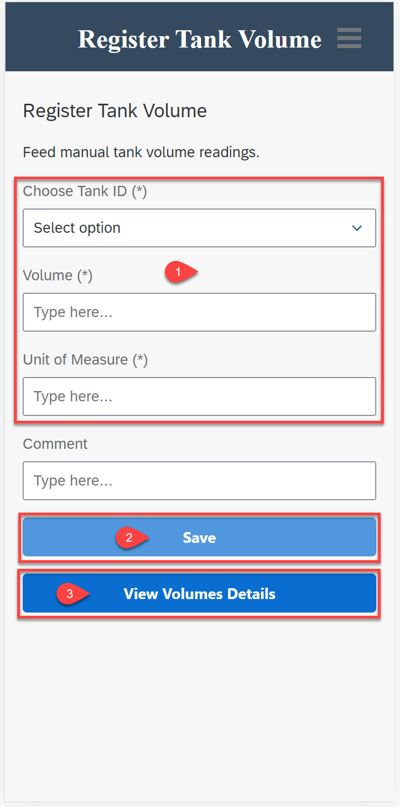

6. Enter values in the mandatory fields (marked with **\***), for example, **T088**, **100**, **Mbl**, and choose **Save**.

7. Choose **View Volume Details**.

   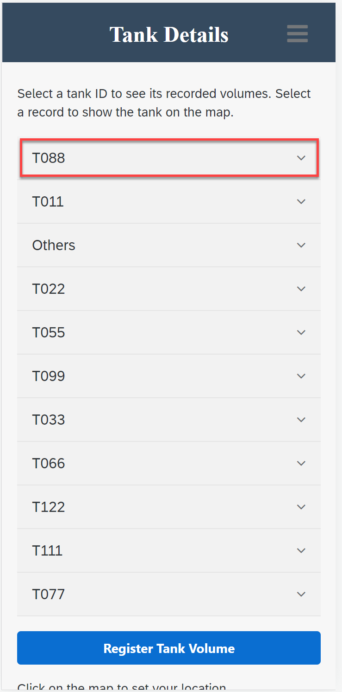

8. Choose the topmost tank to see its readings. You should see the entries that you have made.

9. Choose a record and then scroll down to the map to see the corresponding marker.

## Explore the Implementation

### Moving Between Pages

1. On the top left section, choose the name of your current page **Home page**, which is highlighted in light blue to open the page menu of SAP Build Apps.

   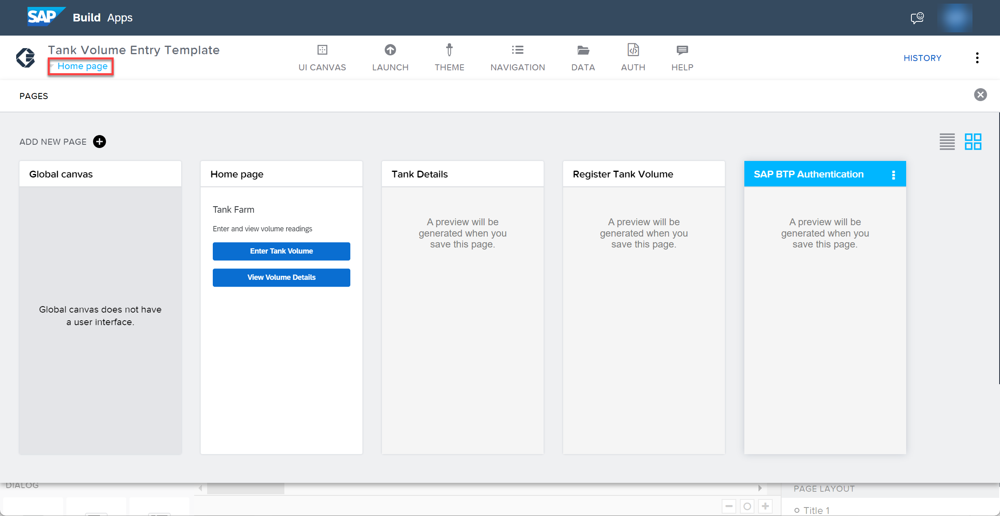

   You can see the pages of the appication. This is where you select the page you want to work on.  

2. Choose the **Home page** to go back to it.

### The Home Page

On the UI canvas in the center of your screen, there are standard components (**Title**, **Text**, and two **Buttons**) that have been dragged from the **CORE** tab on the left of your screen. 

1. Choose **Enter Tank Volume**. 

   Its properties are visible in the page on the right of the screen.

2. At the bottom of SAP Build Apps where you can see **Add logic to BUTTON 1**, choose the arrow to open the logic canvas.

   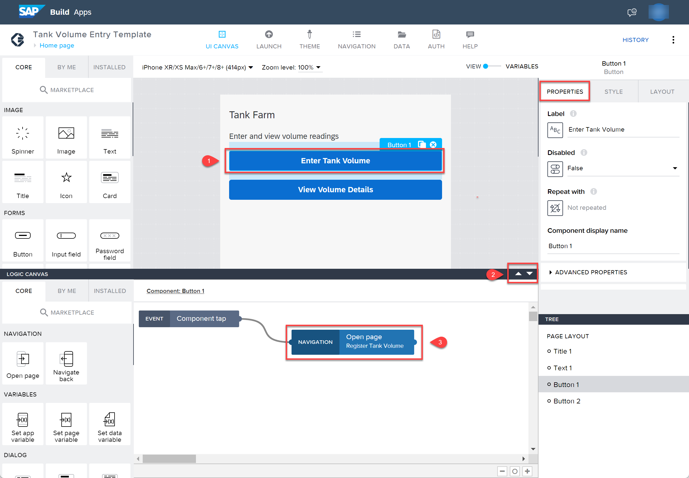

   The **Open page** component has been dragged to the canvas from the **CORE** tab and conected to the **Component tap** component.

3. Choose the **Open page** component to see its configuration in the **PROPERTIES** section.

### The Register Tank Volume Page

On the UI canvas in the center of your screen, there are standard components (**Title**, **Text**, **Dropdown field**, three **Input fields** and two **Buttons**) that have been dragged from the **CORE** tab on the left of your screen. 

#### Variables

1. From the UI canvas, choose the toggle button to switch from **VIEW** to **VARIABLES**.

2. Choose **APP VARIABLES** on the left side of SAP Build Apps.

   The **current_tankid** application variable is available on all pages.

3. Choose **PAGE VARIABLES** on the left side of SAP Build Apps.

   The **pv_ndr_tankvolumes** page variable is only available on this page and is used in the binding of the UI components to receive the user's input.

4. Choose **DATA VARIABLES** on the left side of SAP Build Apps.

   A data variable is essentially the same as a page variable that exists in the context of the current page that is not accessible from other pages. The difference is that it gets its schema from the data resource it points to, and it comes with included default logic.

   * **getTanks** is filtered so that only the tanks that require manual registration are returned.
   
   * **NewdrTankVolumes** is for a new record and has no logic associated with it.

5. Toggle back to the **VIEW** mode.

#### Page Mounted Event

A **Page mounted** event fills the **pv_ndr_tankvolumes.tank_id** page variable with the **current_tankid** application variable if the application variable is not empty.

1. At the bottom of SAP Build Apps where you can see **Add logic to REGISTER TANK VOLUME** when you select the page, choose the arrow to open the logic canvas.

   The **If condition** evaluates the formula **LENGTH(appVars.current_tankid.id) > 0** and is followed by the **Set page variable** component.

#### Field Configuration

1. Select the dropdown field.

   On the right side **PROPERTIES** section, the **Option list** uses the **getTanks** data variable as the source data and the **Selected value** is the **pv_ndr_tankvolumes.tank_id** page variable.

2. Select each **Input** field in turn. Each **Value** is bound to the corresponding value from **pv_ndr_tankvolumes**.

#### Button Configuration

1. Choose **View Volume Detail**.

   On the **Logic canvas** the **Set app variable** component resets the application variable before the **Open page** component navigates to **Tank Details**.

2. Choose **Save**.

   On the **Logic canvas**, the **Set data variable** component sets **NewdrTankVolumes** with the values **pv_ndr_tankvolumes** and uses the function **NOW()** to provide a timestamp. The **Create record** component creates a new record in **TankVolumes** using the **NewdrTankVolumes** data variable. After saving the changes, the **Set page variable** component clears the page variable.

   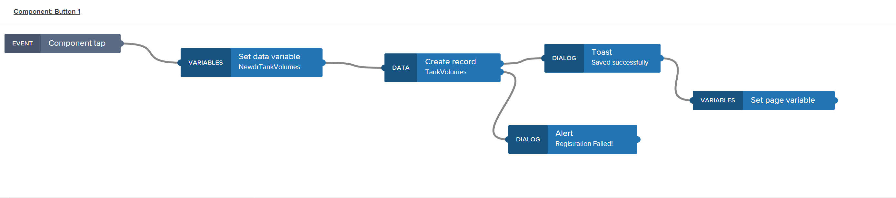

   In the **Properties** panel, the **Disabled** property is determined by a formula that evaluates to true if any of the mandatory fields is empty.

### The Tank Details Page

On the UI canvas in the center of your screen, there are standard components (Two **Texts** and a **Button**) that have been dragged from **CORE** tab on the left of your screen. The **Collapsible grouped basic list** and **Embedded map view (beta)** have been installed from the marketplace and then dragged onto the canvas from the **INSTALLED** tab.
	
1. Choose **Register Tank Volume** to navigate to the **Register Tank Volume** page.

2. Select the **Collapsible grouped basic list** to see its configuration in the **PROPERTIES** section.

   Unlike the basic components, this components can consume a Data resource without the need for a Data variable. The data entity used here is **TankVolumes**. The **Field Configuration** is as follows:
   * **content** LOOKUP(source.record, "VOLUME") + " " + LOOKUP(source.record, "UOM")
   * **groupBy** TANK_ID
   * **id** TANK_ID
   * **label** COMMENT
   * **title** FORMAT_DATETIME_LOCAL(LOOKUP(source.record, "TIME_STAMP"), "DD.MM.YYYY")
		
   Under **Properties** &rarr; **OPTIONAL**, as sort option for the timestamps in descending order has been configured. 

   On the **Logic canvas**, the **Set data variable** component sets the **current_tankid**  app variable to the value of the **id** of the **Most recently tapped item**.

   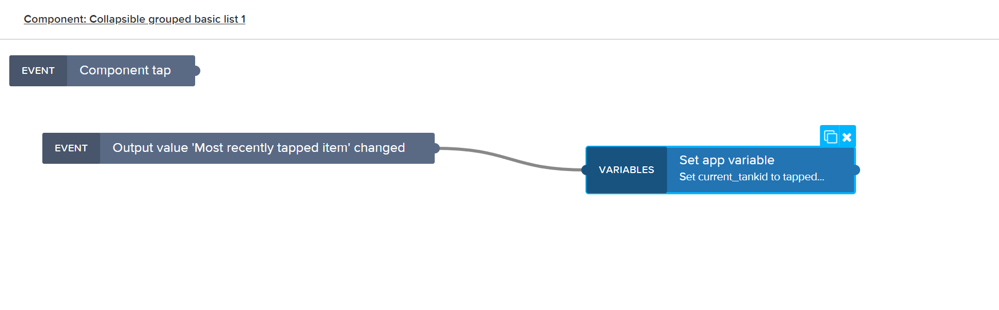

3. Select the **Embedded map view (beta)** to see its configuration in the **PROPERTIES** section.

   On the **Logic canvas**, the **Set data variable** component sets the **pv_latitude** and **pv_longitude**  page variables to the values from the **onPress** event. These variables are used to set the **Your location** marker on the map.

   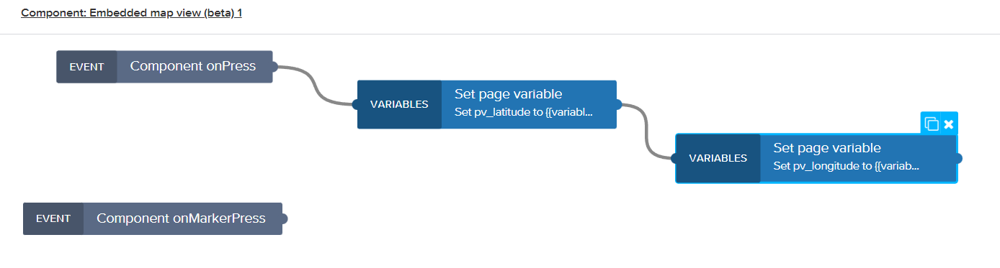

## Summary

You have now a working application that can be used to read and write data to the backend system. In the next exercise you will deploy it as an HTML5 application in SAP BTP.
