# Create SAP Cloud Application Programming Model (CAP) Project Using SAP Business Application Studio

The CAP application reads master data as a view from SAP Datasphere Space, writes transactional data into it using an HDI (HANA Deployment Infrastructure) container, and then makes this data available for SAP Build Apps to use through an OData service.

## Open SAP Business Application Studio
    
Open the SAP Business Application Studio from the SAP BTP cockpit, create a development space, and import your MTA (Multitarget Application Development) CAP project. This will allow you to start working on your project within the development environment.

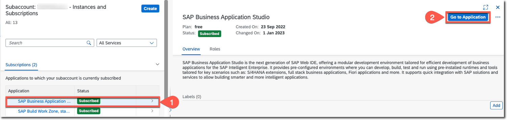

## Create Dev Space in SAP Business Application Studio

To create dev space for building a Full Stack Cloud Application, follow these steps:

1. Create dev space with the application type **Full Stack Cloud Application**.
    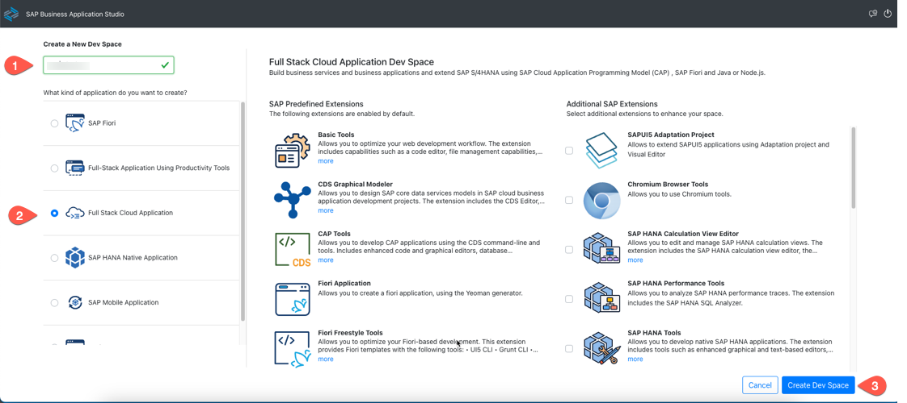
2. Once the Dev Space is created, the status is changed from **Starting** to **Running**.
    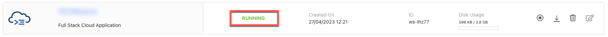
3. Choose the dev space name to open it.

See [Full Stack Cloud Application](https://help.sap.com/docs/bas/sap-business-application-studio/full-stack-cloud-application).

## Import Project

1. Download [the CAP project file](../../../code/CAPApplication/DWCMission.tar).
2. Make sure there is an open workspace in your dev space. If there is no open workspace:
    1. Choose **Open Folder**.
    2. Select **projects** from the list provided in the command palette.
    3. Choose **OK**.
    
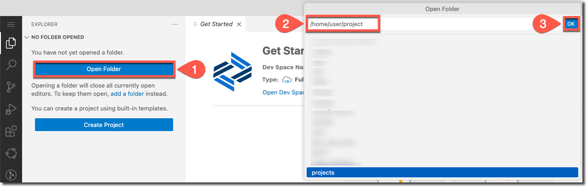

3. From the **Get Started** page, choose **Import**. Choose the downloaded file, and then choose  **Open**.
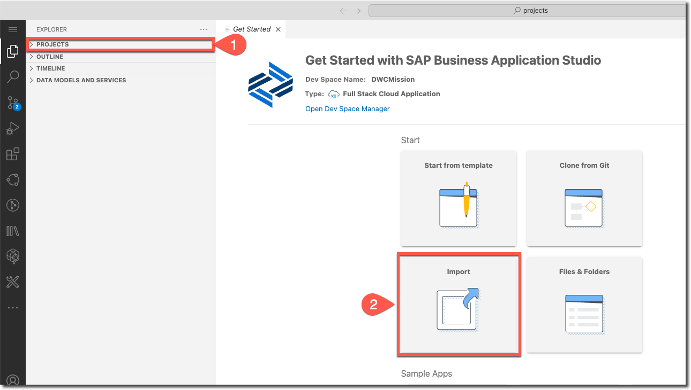

>Hint: If you do not see the **Get Started** page, enter **Get Started** in the **command palette**. 

See [Importing Projects](https://help.sap.com/docs/bas/sap-business-application-studio/importing-projects).

### HDI Artifacts

To access the data from SAP Datasphere, you should specify the HDI roles, views, specific actions (read/write/select), SAP BTP user-provided service and HDI container to point to datasphere database.

1. The hdi roles, view specifications are defined under **db/src/dwc**.
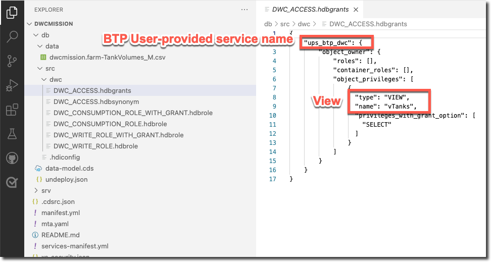

2. If needed, change the SAP BTP user-provided service name in this file to the name of the [user-provided service](../create-user-provided-service) which is created earlier. Similarly, the SAP Datasphere master data view name should be adjusted accordingly. See [Create Master Data Table and Views in SAP Datasphere Space](../create-master-table/README.md#create-graphical-view-vtanks). 

3. SAP Datasphere Space ID is specified in the synonym file to set the target. Make sure to adjust it to your [Space ID](../../set-up/set-up-datasphere/README.md#create-space).
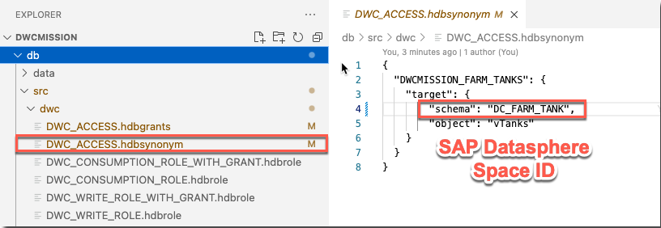

4. The user-provided service is configured in **mta.yaml** file as one of the resources.
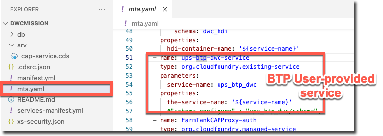

5. If needed, change the service-name to the name of the [user-provided service](../create-user-provided-service) which is created earlier.

6. The HDI container is configured in the **mta.yaml** file and uses the database ID from SAP Datasphere.
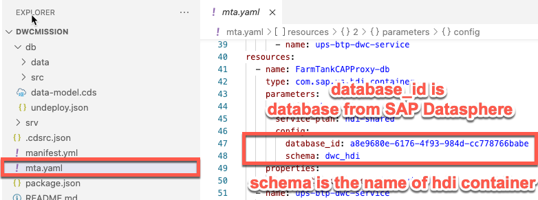

7. In SAP Datasphere, choose **System** from the side navigation area, choose **About**, and save the **Database** which is used to configure the HDI container in the **mta.yaml** file.
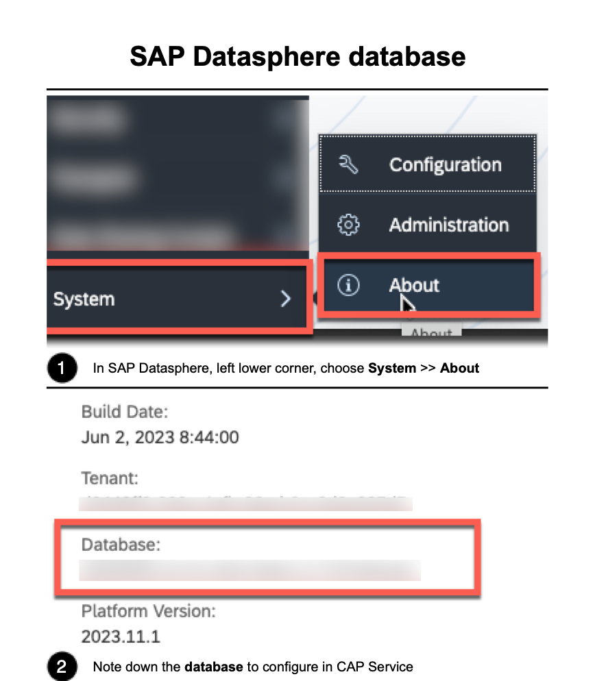

8. Update the database_id to your SAP Datasphere database id in the **mta.yaml** file and **Save** it.

9. **DWC_HDI** is given as a schema name in the **mta.yml** file which will be available in the [SAP Datasphere space](../create-analytic-model/README.md#add-hdi-container-into-the-space) once this application is deployed.

See: 
* [Access Space Objects in Your HDI Container](https://help.sap.com/docs/SAP_DATASPHERE/be5967d099974c69b77f4549425ca4c0/656eebc2ced14ec09afa455224fa9a98.html?locale=en-US)
* [Allow Your Space to Write to Your HDI Container](https://help.sap.com/docs/SAP_DATASPHERE/be5967d099974c69b77f4549425ca4c0/aa3627f987d04b5f95fec1c45083dde9.html?locale=en-US)
* [Blog Post: Expose SAP Datawarehouse Artifacts](https://blogs.sap.com/2021/03/18/expose-sap-data-warehouse-cloud-artefacts-as-odata-v4-service/)

### OData End Point

1. The annotation **@cds.persistence.exists** lets the CAP model know that there is an entity already existing with the same name and it should not create a new entity.
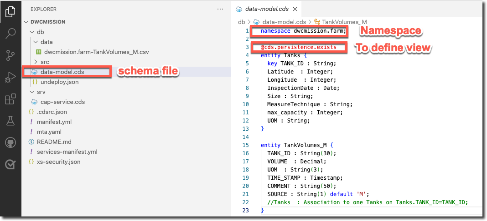

2. The service model is defined in **cap-service.cds** which will expose the CDS entity above as OData service.
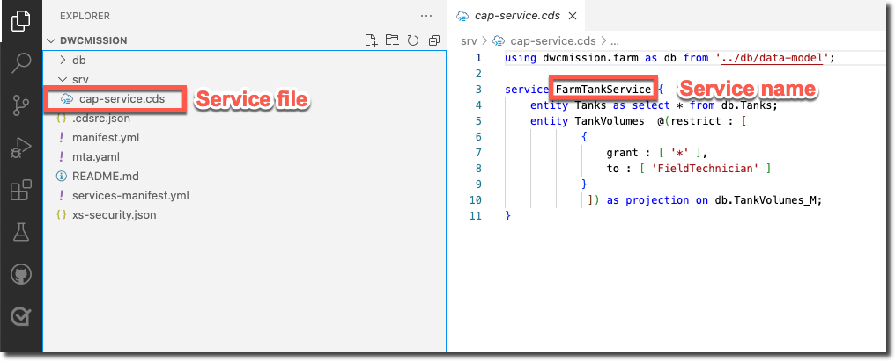

3. Authentication roles are specified in the **.cdsrc.json** file.

## Summary
 
You have created an CAP project which reads and writes into the SAP Datasphere space and exposes an OData service for external consumption.

