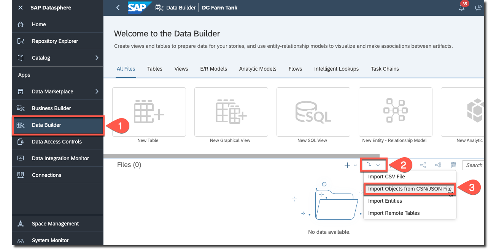
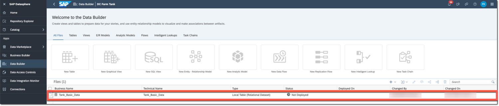
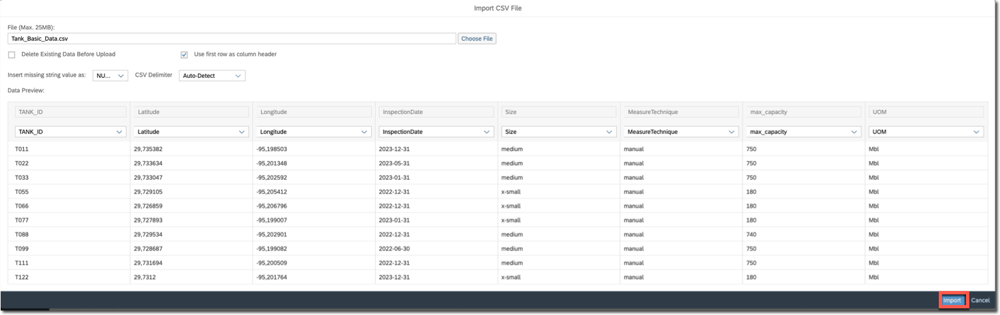
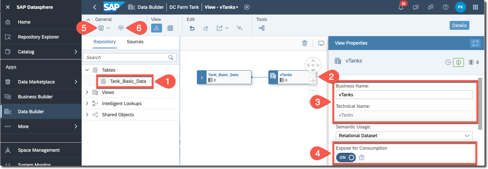
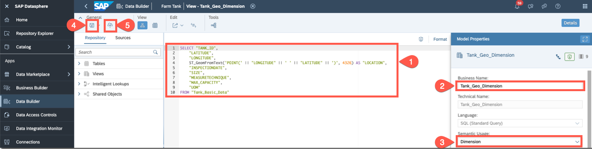

# Create Master Data Table and Views in SAP Datasphere Space

In this section, you will create a master table to store fundamental tank information. Subsequently, you will generate views based on this table to allow read-only access to the tank data.

The following SAP Datasphere artifacts will be created:
* Master data table (Tank_Basic_Data)
* Graphical view (vTanks)    
* SQL view to have calculated Geo locations (Tank_Geo_Dimension)

## Create Master Data Table

Create the **Tank_Basic_Data** table using a JSON file that defines its structure, and upload the basic data from a CSV file into the table.

### Prerequisites 

To download the [Tanks.json](../../../code/Datasphere/Tanks.json) and [Tanks.csv](../../../code/Datasphere/Tank_Basic_Data.csv) files, follow these steps:

1. Open each of the files in another browser tab.

2. Right click **Raw** at the top of each file.

3. Choose **Save Link As…**, and then select the location on your local file system where you want to save the file. Then, choose **Save** with **Correct file extension**.

### Create Master Table

1. In the side navigation area, choose  **Data Builder**. Choose a space if necessary.

2. Choose **Import**, and then choose **Import Objects from CSN/JSON File**.



3. Select the file **Tanks.json** and choose **Open** to open **Select Objects to Import**.

4. Select **Tank_Basic_Data** and choose **Import CSN File**.

5. Select **Tank_Basic_Data** to open it and choose **Deploy**.



6. Choose **Upload Data from CSV** file in the **Edit** section to open **Import CSV File**.

7. Choose the **Tanks.csv** file, and then choose **Open**.



8. Choose **Import**.

9. The data can be viewed from **Data Viewer** in the **View** Section.

10. Deploy the table and close it.

See [Importing Objects from a CSN/JSON File](https://help.sap.com/docs/SAP_DATASPHERE/c8a54ee704e94e15926551293243fd1d/23599e6347fb4c9e9a71c82f62449875.html).

## Create Graphical View (vTanks)

This database view contains comprehensive information about the tanks, intended to be accessed by a CAP application that will be developed at a later stage.

1. In the side navigation area, choose  **Data Builder**. Choose a space if necessary.

2. Choose **New Graphical View** to open the editor.

3. In the **Repository** section, expand **Tables**, drag the **Tank_Basic_Data** table and drop it into the diagram.

4. Select the view and enter **vTanks** in the **Business Name** and **Technical Name** fields.

5. Choose **Expose for Consumption**.



6. Save the view and deploy it.

See [Creating a Graphical View](https://help.sap.com/docs/SAP_DATASPHERE/c8a54ee704e94e15926551293243fd1d/27efb479c4814252964d3fbc6ca2dfc3.html)

## Create SQL View (Tank_Geo_Dimension)

You will be creating a new **SQL view** of **Dimension** type to store geo-locations for the SAP Analytics Cloud dashboard.

1. In the side navigation area, choose  **Data Builder**. Choose a space if necessary.

2. Choose **New SQL View** to open the editor.

3. Paste the following SQL statement:

```
SELECT "TANK_ID",
	"LATITUDE",
	"LONGITUDE",
	ST_GeomFromText('POINT(' || "LONGITUDE" || ' ' || "LATITUDE" || ')', 4326) AS "LOCATION",
	"INSPECTIONDATE",
	"SIZE",
	"MEASURETECHNIQUE",
	"MAX_CAPACITY",
	"UOM"
FROM "Tank_Basic_Data"
```

4. [Optional] Choose **Format** & **Validate SQL** from the canvas menu.

5. In the **Business Name** field, enter **Tank_Geo_Dimension**.

6. In the **Semantic Usage** dropdown menu, select **Dimension**.

7. Select **ON** for the **Expose for Consumption** field.

8. [Optional] The data can be viewed from **Data Viewer** in the **View** section.

9. Choose **Save**, and then choose **Deploy**.
    
>**Note:** If you encounter the 'Your model seems to be empty. Please add some columns.' error before saving the view, it will be removed when you save the view.



See [Creating an SQL View](https://help.sap.com/docs/SAP_DATASPHERE/c8a54ee704e94e15926551293243fd1d/81920e4d583f45fd8761c662d3c8abab.html).

## Summary
 
You have successfully created the master data table and views.
