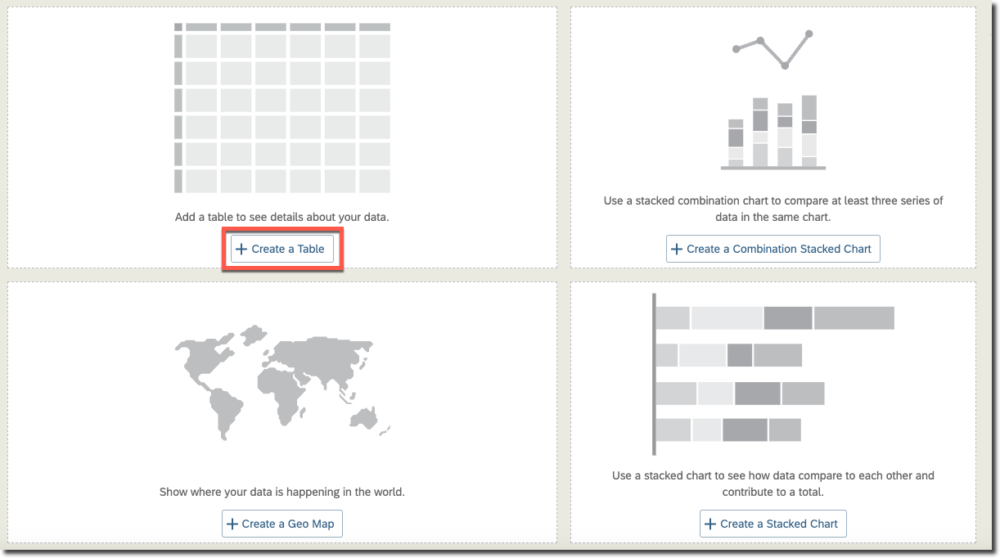
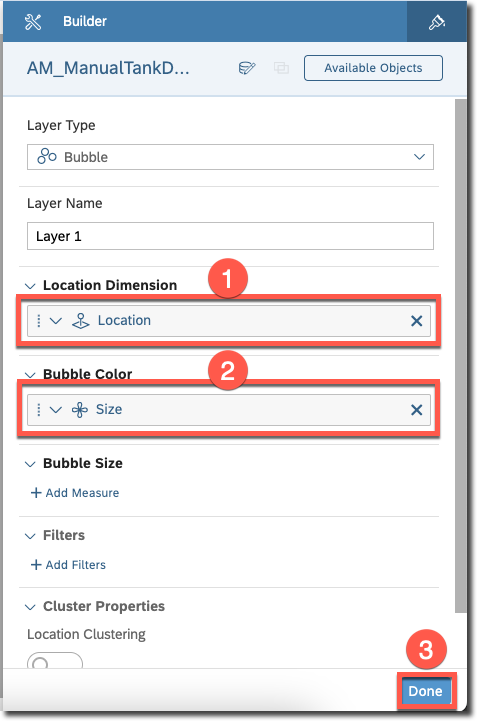

# Create SAP Analytics Cloud Dashboard

Stories are at the center of the SAP Analytics Cloud experience. A story is a document that uses charts, visualizations, images, and other objects to describe and analyze data. You can share your stories with other users and grant permissions for these stories. When you share your stories, users with view permissions can analyze the data by navigating within the stories.

## Create a Story

Create a story that analyzes the latest readings and tank details. You'll use a page filter, charts, a table, and a map for this analysis.

1. Open SAP Analytics Cloud.
2. From the side navigation, choose **Stories**.
3. In the **Templates** section, choose **Dashboard** to open **Select Design Mode Type**.

3. Choose **Optimized Design Experience** as design mode and choose **Create**.
4. Choose **Map, table and content** as dashboard layout.

5. Choose **Apply**, and then choose **Close**.
6. Enter **Farm Tank Volume Dashboard** in the title.
7. Save the story.
8. [Optional] Close the **Left Side Panel** and stay in **Edit** mode.

See [Create a New Story](https://help.sap.com/docs/SAP_ANALYTICS_CLOUD/00f68c2e08b941f081002fd3691d86a7/f0cc6e14392e4b18b0f1bcaab839cc2d.html?locale=en-US).

## Add Data to the Story

Use the analytic model which was created in the SAP Datasphere to feed the data into the SAP Analytics Cloud story artifacts.

1. In the **Tools** section in the top menu, choose **Add New Data**.

2. Choose **Data from an existing dataset or model** to open **Select Dataset or Model**.

3. Under **Datasphere**, choose the [connection](../../set-up/set-up-sac/README.md#create-live-data-connection-to-sap-datasphere) you have created earlier.
4. It lists out the spaces from the SAP Datasphere tenant.

4. Choose your space (for example, TANK_FARM) to get the list of artifacts exposed for consumption.
5. Choose **AM_ManualTankDetailsAll** the analytic model.
6. Save the story.

See [About Adding Data to a Story](https://help.sap.com/docs/SAP_ANALYTICS_CLOUD/00f68c2e08b941f081002fd3691d86a7/4951496a66054bb7b0a0b5e66232c059.html?locale=en-US).

## Add Page Filter

Use SAP Analytics Cloud story and page filters to narrow the scope of your analysis. The Story filter allows you to apply filters for all charts and tables in a story that are based on the same model. The Page filter is the same as the Story filter, but applies to just one page in a story. An **Input Control** is one type of the Page filters.

In this section, your task is to incorporate an input control that allows users to filter the most recent readings based on a specific range of reading dates.

1. Choose **Create** from the Input Control.
2. Choose **Dimensions**.

3. Choose **TIME_STAMP** > **Filter by Range**.

3. Choose **+ Add a New Range**, and in the **Granularity** dropdown menu, select **Day**.
4. In the **Settings for Users** section, choose **Single Selection** and then choose **OK**.

5. Expand the page filter horizontaly to view the title (TIME STAMP) and the date ranges.
6. In the **Title** field, enter **Tank Volume Reading Date**.
7. In the **Look Back** field under the selected year, enter **10** to view the data in the charts & table.

7. Save the story.

See [Applying a Story or Page Filter](https://help.sap.com/docs/SAP_ANALYTICS_CLOUD/00f68c2e08b941f081002fd3691d86a7/6b8e8e8bbe5f4571886df58d9fa79127.html?locale=en-US).

## Create a Table

The table presents the most recent readings organized as rows, including tank ID, reading date, comments, and volume with its corresponding unit of measure (UOM).

1. Choose **+ Create a Table** to open the **Builder**.

2. Expand **Table Structure**. In the **Rows** section, choose **+ Add Dimensions**.

3. Under **DIMENSIONS**, select TANK_ID, TIME_STAMP, COMMENT, UOM.
4. Enter **Latest Tank Readings** in the title.
5. Save the story.

See [Creating a Table](https://help.sap.com/docs/SAP_ANALYTICS_CLOUD/00f68c2e08b941f081002fd3691d86a7/d4149fbb71e640f28ca82d4c79d4d0ff.html?locale=en-US).

## Create a Geo Map

The map displays the positions of individual tanks, visually distinguished by colored bubbles indicating their respective sizes.

1. Choose **+ Create Geo Map** to open the **Builder**.
2. Under **Content Layers**, choose **+ Add Layer**.
3. Under **Location Dimension**, choose **+ Location Dimension Required** to open location dimensions. You see the **Location** is listed. Select the location.
4. Under the **Bubble Color**, choose **+ Add Measure/Dimension**, select **Size(Member)** under **Dimensions**. 

5. Select **Done** to go back to the **Geo Map Layers**.
6. Under **Base Layer**, choose **Hybrid** as the **Base Layer Style**.
7. Enter the title **Tank Location**.
6. Save the story.

See [Creating a Geo Map](https://help.sap.com/docs/SAP_ANALYTICS_CLOUD/00f68c2e08b941f081002fd3691d86a7/6ade40e98e9c4f11ab3ad28d345ab54f.html?locale=en-US).

## Create a Vertical Bar Chart

The vertical bar chart illustrates the latest readings categorized by tank ID and volume.

1. Choose one of the charts from **+ Create a Stacked Chart** or **Create Combination Stacked Chart** to open the **Builder**.
2. Choose **Bar/Column** as the chart type.
3. Choose **Vertical** as the **Chart Orientation**.
4. Under Measures, choose **+ At least 1 Measure required** and select **Volume**.
5. Under Dimension, choose **+ Add Dimension** and select **TANK_ID**.
6. Under Color, choose **+ Add Dimension/Measure**, then under Dimensions, expand **TANK_ID** and choose **Size**.

7. Enter **Latest Tank Readings** in the title.
8. Save the story.

See [Creating a Chart](https://help.sap.com/docs/SAP_ANALYTICS_CLOUD/00f68c2e08b941f081002fd3691d86a7/f0e5e294b8d9453d87df35e862ceab99.html?locale=en-US).

## Create a Pie Chart

The distribution of tanks based on their sizes can be visualized using a pie chart.

1. Choose **+ Create a ...*** from the remaining chart to open the **Builder**.
2. Choose **Pie** as the chart type.
3. Under Measures, under **Calculations**, choose **+ Add Calculation** to open the **Calculation Editor**.
4. In the **Type** dropdown menu, select **Aggregation**.
5. In the **Name** field, enter **NoOfTanks**.
6. In the **Operation** dropdown menu, select **COUNT DIMENSIONS**.
7. In the **Aggregation Dimensions** dropdown menu, select **TANK_ID**.
8. Choose **OK**.

9. Under Color, choose **+ At least 1 Dimension required** and then under **Dimensions**, expand **TANK_ID** and then select **Size**.
10. Enter **Tanks per Size in Percentage** in the title.
11. Save the story.

See [Choosing the Best Chart Type for the Data](https://help.sap.com/docs/SAP_ANALYTICS_CLOUD/00f68c2e08b941f081002fd3691d86a7/41836ac6c47d4a96987622a7ecc422b0.html?locale=en-US).

## Add Linked Analysis

Linked analysis is used to drill through hierarchical data or to create filters that simultaneously update multiple charts in your story. 

Create a Linked Analysis to specifically filter the table and bar chart. The other two artifacts, which are basic details, are not directly associated with the reading date.

1. Choose the **Page Filter**. From the **... (More Actions)** menu, choose **Linked Analysis** > **Settings**.

2. Choose **Only selected widgets** and select only **Vertical Bar Chart & Table**.
3. Choose **OK** and then choose **Apply**.

See [Creating a Linked Analysis](https://help.sap.com/docs/SAP_ANALYTICS_CLOUD/00f68c2e08b941f081002fd3691d86a7/c74d35c4218f49778d1a3a0e64dad715.html?locale=en-US).

## Share the Story

Once you have created the story successfully, you can view it by selecting the **View** mode. To share the story with others, you can generate a custom link that enables business users to access it.

1. [Optional] Rearrange the artifacts if needed.
2. Choose **View** in the upper right corner.
3. Choose the **File** menu, then **Share** to open the **Share story** dialog.

4. Choose **Customize Link**, and enter **mode=present** in the **Set URL Parameters** field.
5. In the **Enter a Custom Link** field, give a name for the dashboard, for example **TankVolumeDashboard**.
6. Choose **Save** to go back to **Share Story** dialog.

7. Copy and store the Custom Link for later use.
7. Choose **Close**.

You have two options to access the dashboard:
* Directly use the custom link. See [Share Stories](https://help.sap.com/docs/SAP_ANALYTICS_CLOUD/00f68c2e08b941f081002fd3691d86a7/a9ecd401c9424a3e983a0a0f72bcba2f.html?locale=en-US).
* Add it as a separate application to the SAP Work Zone site. See [Add an app to your subaccount](https://help.sap.com/docs/build-work-zone-standard-edition/sap-build-work-zone-standard-edition/url-and-dynamic-url-apps).

## Access the Dashboard

To analyze the data in the dashboard, simply access the custom link created in the previous step using your preferred browser.

## Summary
 
You have successfully designed a dashboard that enables data analysis through a variety of charts and a page filter. 
