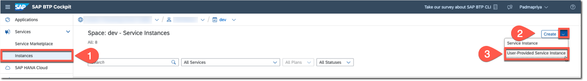
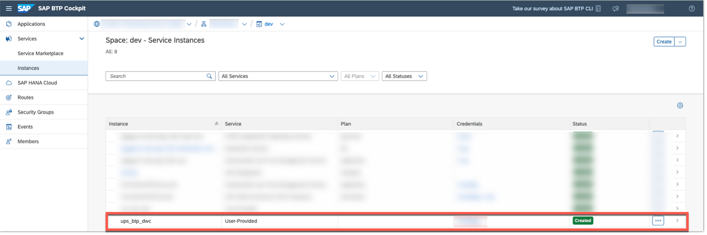

# Create User-Provided Service in SAP BTP Cockpit

To access SAP Datasphere artifacts you need to use a User-provided service. User-provided service instances enable you to use services that aren’t available in the service marketplace with your apps running in Cloud Foundry Environment.

You have already created [Database User in SAP Datasphere](../../set-up/set-up-datasphere/README.md#create-technical-database-user) in the Set Up phase and noted down the credentials.

You will be creating user-provided service in the SAP BTP cockpit using the following steps and will be configuring CAP application in the next section [Create CAP Application](../create-cap-application/README.md#hdi-artifacts).

## Procedure

Let's create a user-provided service in the SAP BTP cockpit.

1. In the SAP BTP cockpit, navigate to your subaccount.
2. In the navigation area, choose **Cloud Foundry** &rarr; **Spaces**. 
3. All spaces in your subaccount appear. Select the space in which you want to create a user-provided service instance.
4. In the navigation area, choose **Services** &rarr; **Instances**.
5. Click on the arrow which is right next to the **Create** in the top-right corner, then from the dropdown list choose **Create User-Provided Service Instance** to open **New User-Provided Service Instance**.

6. In the **Instance Name** field, enter a name. For example, **ups_btp_dwc**.
7. In the **Specify the parameters in JSON format:** field, enter the credentials that you have already saved from SAP Datasphere space earlier in [Create Technical Database User in SAP Datasphere](../../set-up/set-up-datasphere/README.md#create-technical-database-user).
8. Choose **Create**.
9. [Optional] If you have issues with the authorization, make sure that you have **Space Developer** role in the SAP BTP Space.
10. Once the service is created, its status turns into **Created**.

See [Creating User-Provided Service Instances in Cloud Foundry Environment](https://help.sap.com/docs/service-manager/sap-service-manager/creating-user-provided-service-instances-in-cloud-foundry-environment?locale=en-US)

## Summary

You have successfully created a user-provided service, fulfilling the second requirement for accessing SAP Datasphere space objects from your CAP application.
