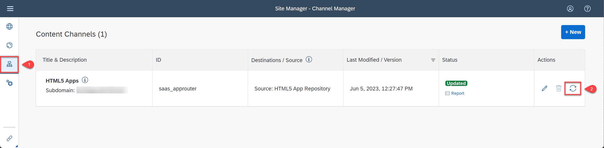
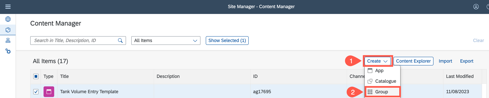

# Integrate the Application with SAP Build Work Zone, standard edition

## Introduction

In this section, the application will be connected with SAP Build Work Zone, standard edition. This allows to have one central entry point to show all of your SAP BTP applications.

###  Integrate with SAP Build Work Zone, standard edition

1. In SAP BTP cockpit, navigate to your subaccount and choose **Services** > **Instances and Subscriptions**.

2. Search for the **SAP Build Work Zone, standard edition** application and choose the icon to open it.

3. In the menu on the left side choose the icon for **Channel Manager**.

4. Choose the **Refresh** icon to fetch the updated content.

    

5. Choose **Content Manager** in the menu on the left and open the **Content Explorer** tab.

6. Select the **HTML5 Apps** tile with your respective subdomain name.

    

7. In the **Items** table, select the checkbox of your application and choose **Add**.

    

8. Go to the **My Content** tab, choose **Create** and select **Group** from dropdown.

    

9. Add a title e.g. _Tank Farm_.

10. Find your applications in the table. In row Assignment Status switch **toggle button** to on

11. Choose **Save**.

    

12. Go back in **Content Manager**, and choose **Create** and select **Role**.

    

13. Enter the _FieldTechnician_ as title. Find your application in the table. In row Assignment Status switch **toggle button** to on

14. Choose **Save**.

    

    The role **FieldTechnician** means that a user needs to have a Role Collection named **FieldTechnician** assigned to it in order to access the application.

15. In the menu on the left side, navigate to **Site Directory**.

16. Choose **Create Site**.

    

17. Enter the name for the site and choose **Create**.

    Now, you are forwarded to the site editor.

18. Add the role **FieldTechnician** to the site.

    

19. Navigate to **Site Directory**.

20. Find your created site and open it by choosing **Go to site**.

    

21. Test the application by clicking the tile.

    

 ###  OPTIONAL: Add SAP Analytics Cloud Application to Site

Although the field technician who does the manual readings would not be expected to access the SAP Analytics Cloud application, you can add it to your site if you want. Add the application to the Content Manager using the URL created when you shared the story following the steps at [Create SAC Dashboard](../create-sac-dashboard/README.md#share-the-story). For more details, see the SAP Build Work Zone [documentation](https://help.sap.com/docs/build-work-zone-standard-edition/sap-build-work-zone-standard-edition/configure-apps-for-your-subaccount).
 
 ## Summary

You have finished the development of your application. In this last step you have integrated SAP Build Work Zone, standard edition service, to have one central entry point to show all of your SAP BTP applications.
