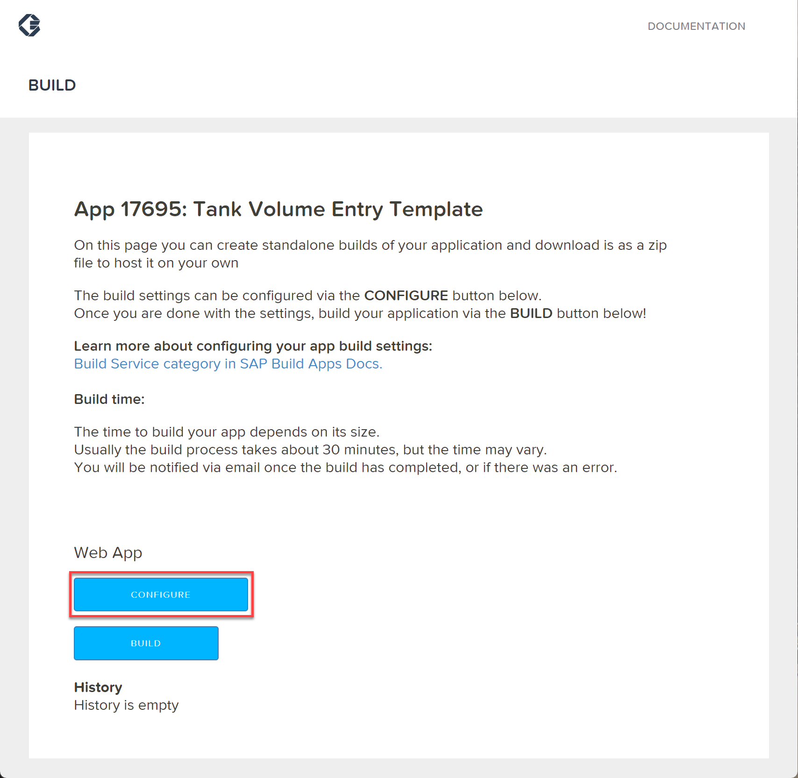
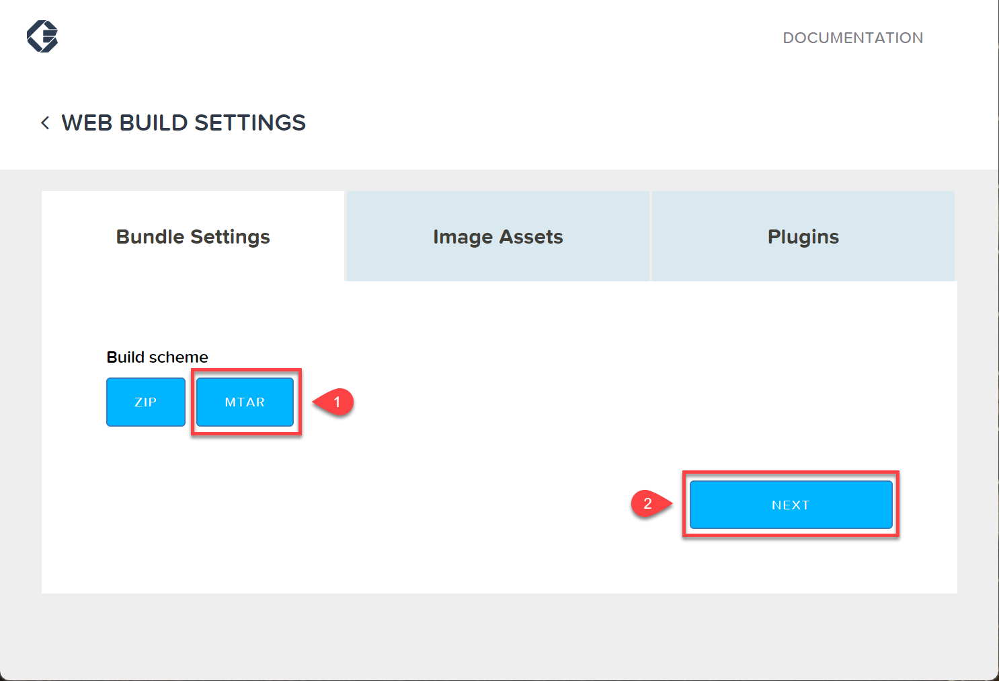
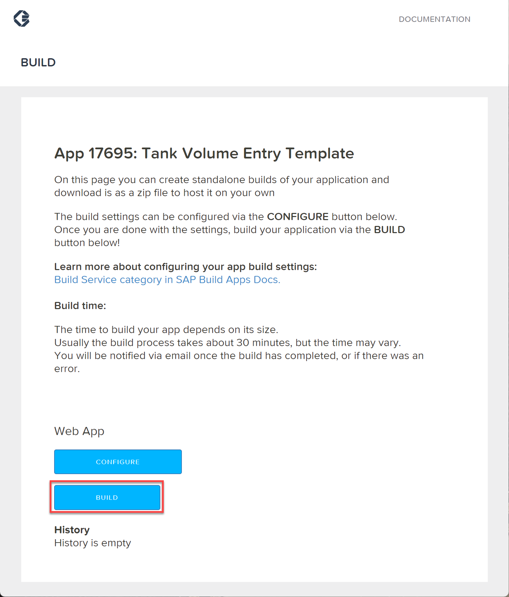
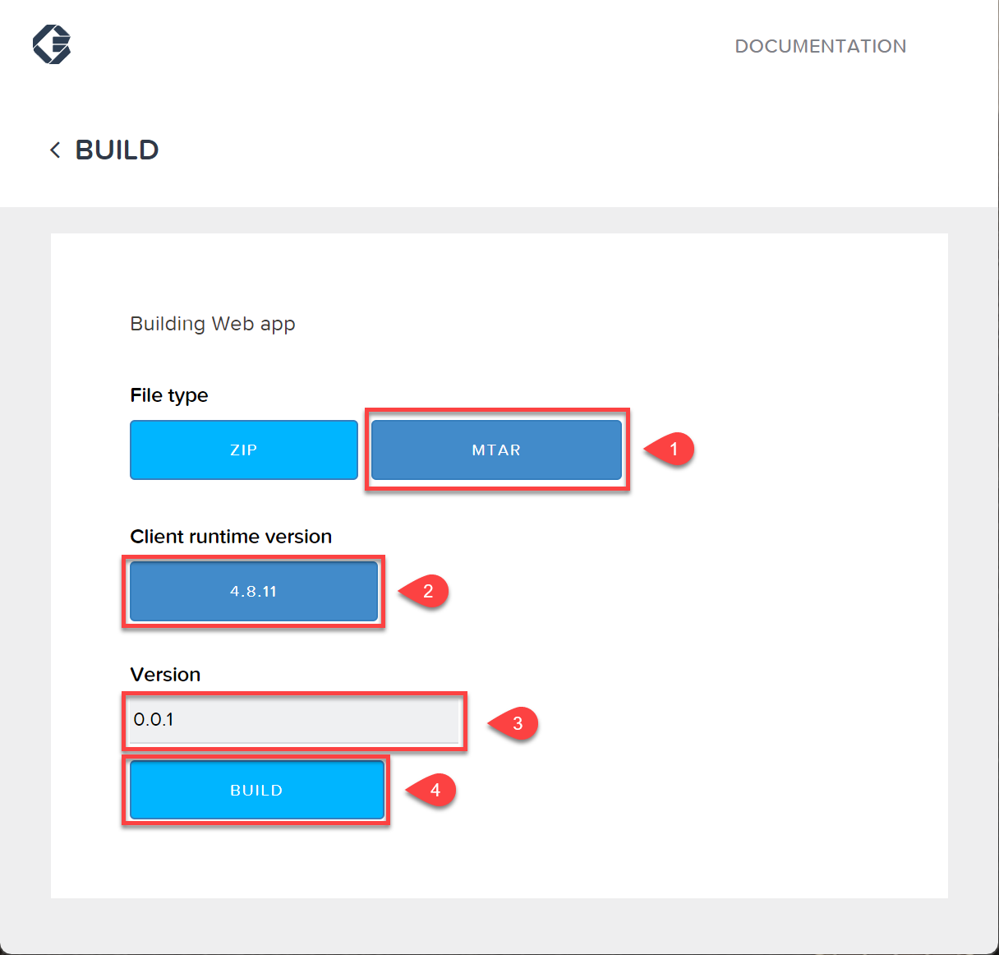
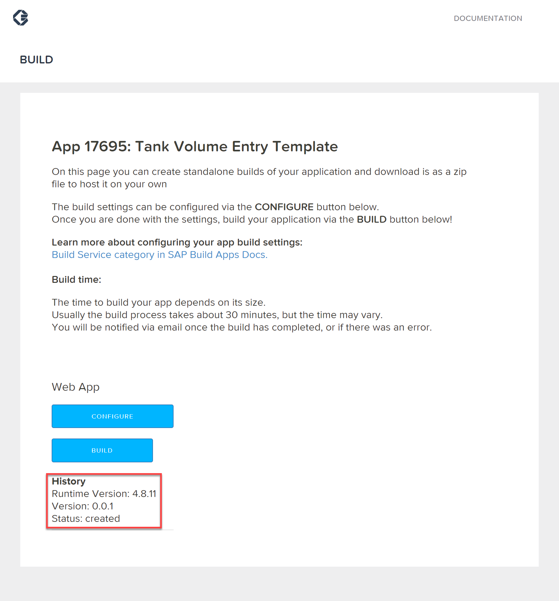
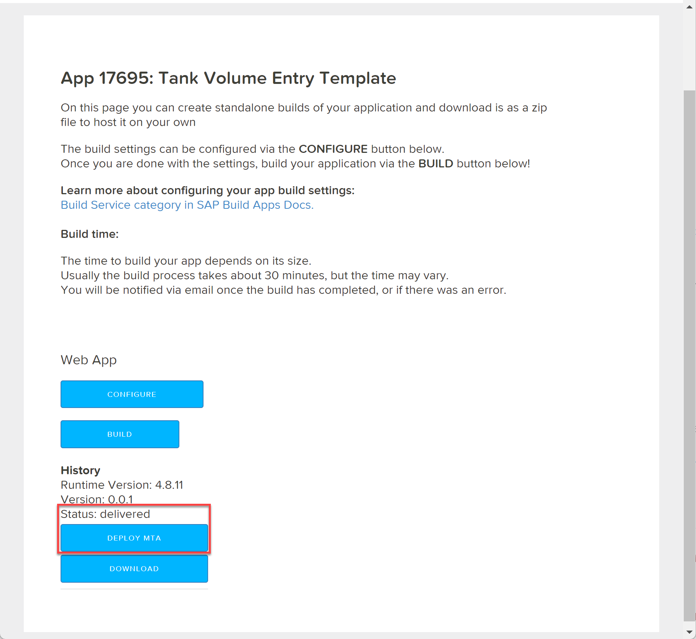
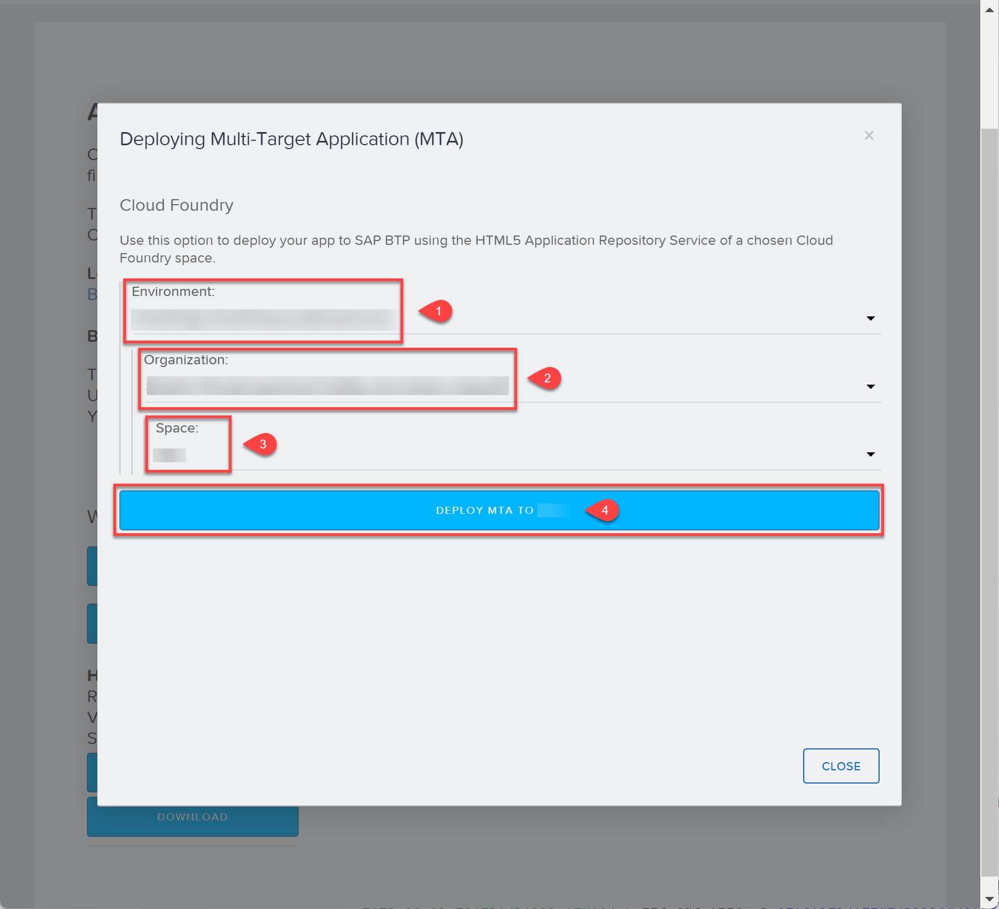
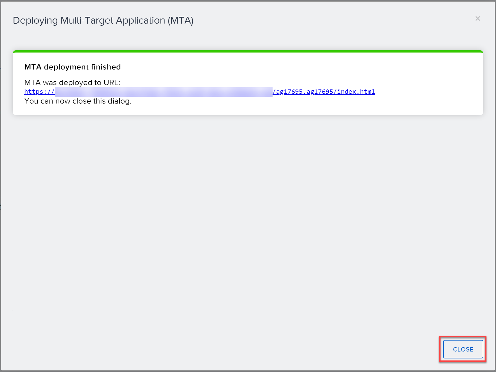
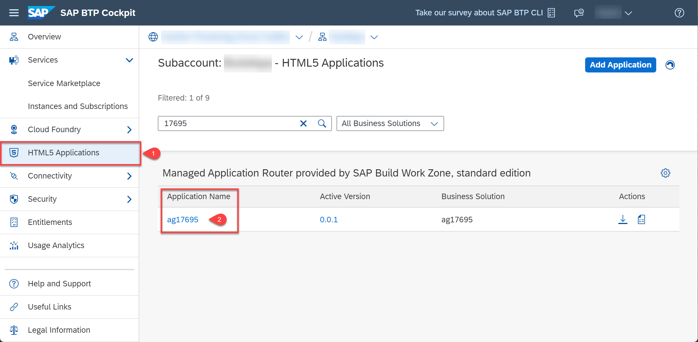

# Build and Deploy Your SAP Build Apps Application to SAP BTP

## Introduction

In this section you will build the application that you have created using SAP Build Apps, and then deploy it in SAP BTP as an HTML5 application.

## Build the Application

1. In **SAP Build Apps**, choose **LAUNCH**.

2. Choose **OPEN BUILD SERVICE**.

   

3. In the **Web App** section, choose **CONFIGURE**.

   

5. In the **Bundle Settings** tab, choose **MTAR** and then choose **NEXT**.

   

6. In the **Image Assets** tab, choose **NEXT**.

7. On **Permissions**, choose **NEXT**.

8. In the **Web App** section, choose **BUILD**.

   

9. Choose the **MTAR** file type.

10. Choose the latest runtime version.

11. Enter a version number, for example, **0.0.1**.

12. Choose **BUILD**.

   

   The **History** section now shows the status **created**.

   

   The **Build** page will not notify via e-mail once the build has been completed. You have to refresh the browser to check if the build has been completed. The build can take more than 10 minutes.

13. Refresh the browser until the status changes from **created** to **queued** and then finally to **delivered**, at which point a **DEPLOY MTA** button appears. This can take several minutes.

    
     

## Deploy the Application

1. In the **Web App** section, choose **DEPLOY MTA**.
   
   You will need to authorize yourself using your identity provider the first time you do this.

2. Select the values in the **Environment**, **Organization** and **Space** fields, and then choose **DEPLOY MTA TO \<SPACENAME\>**.

    

3. Wait until the deployment is completed and choose **CLOSE**.

    

## Check the Deployment

1. In the **SAP BTP cockpit**, navigate to your subaccount.

2. From the left-side subaccount menu, navigate to **HTML5 Applications**.

   In the **Managed Application Router provided by SAP Build Work Zone, standard edition** section, you will find a list of applications.

   

3. Click the **Application Name** (this will be the build number).

   Your application opens. Depending on how your subaccount is configured, you might need to choose the identity provider and log in.

## Summary

You have deployed the application that you have developed in SAP Build Apps to SAP BTP as an HTML5 application that can be consumed using a URL.
