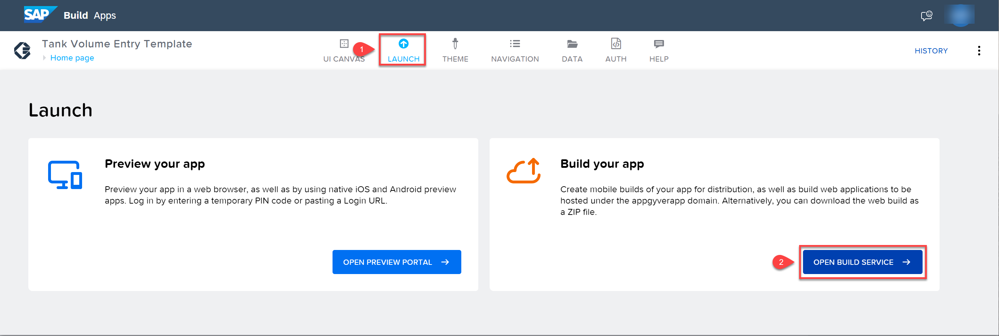
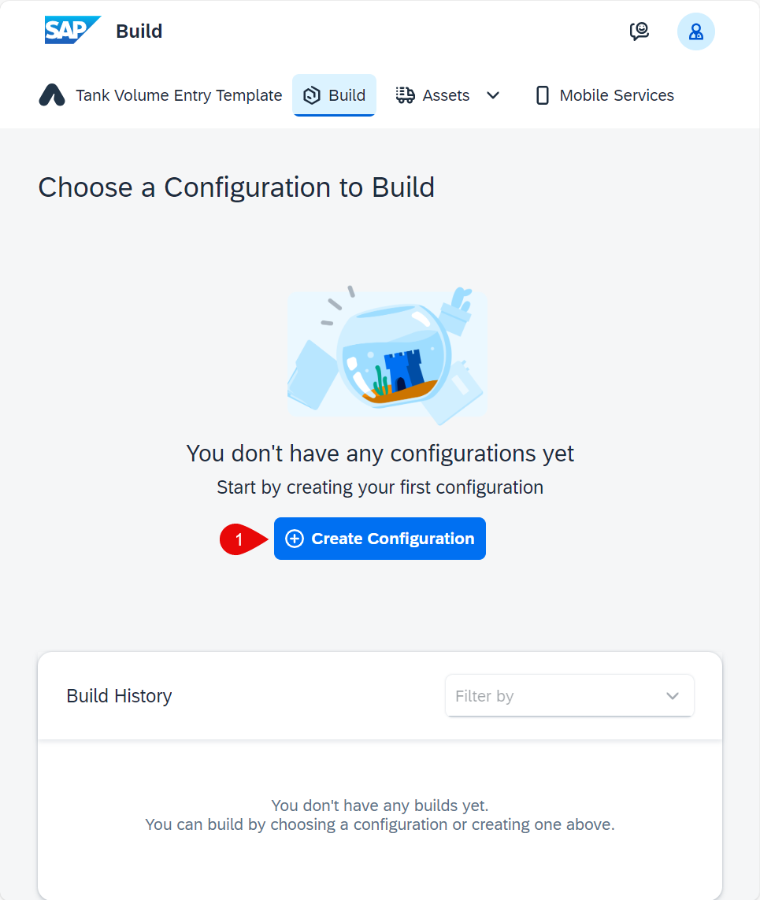
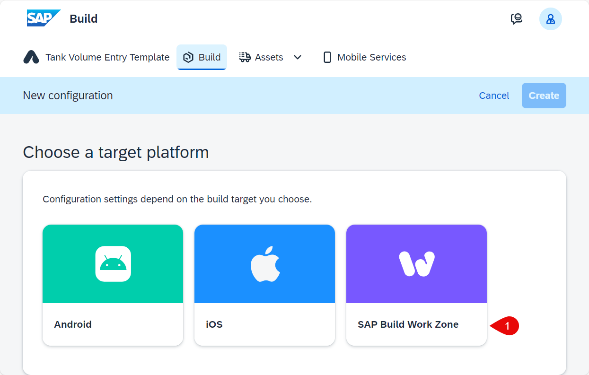
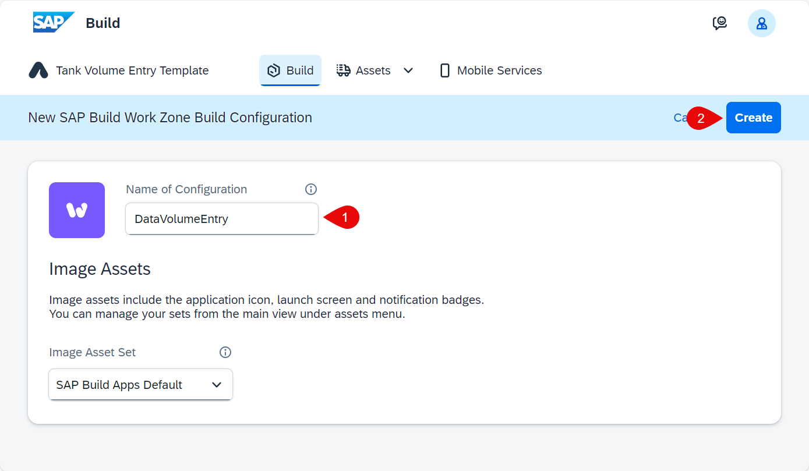
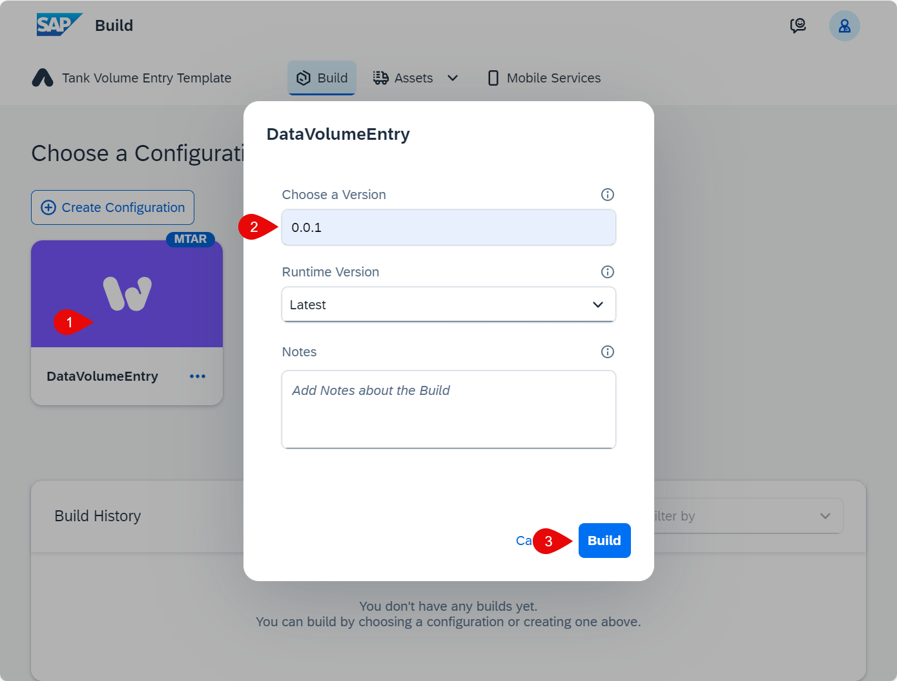
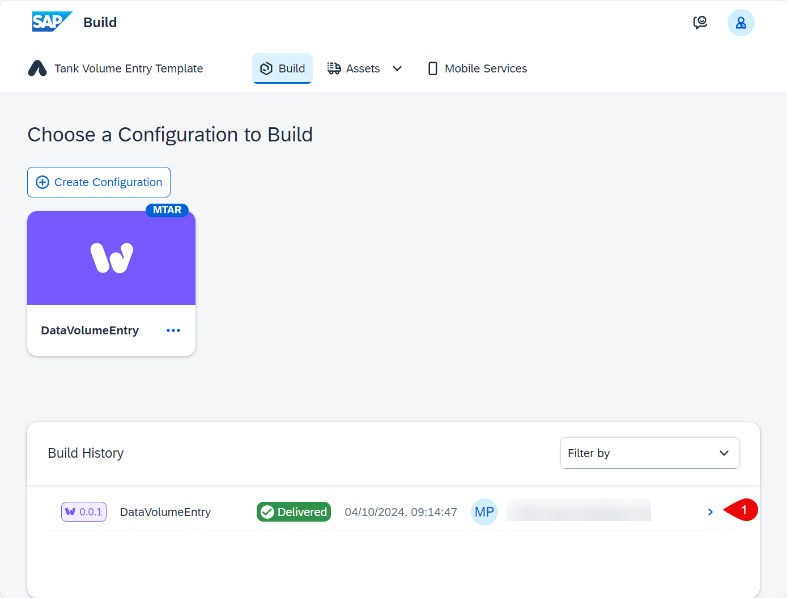
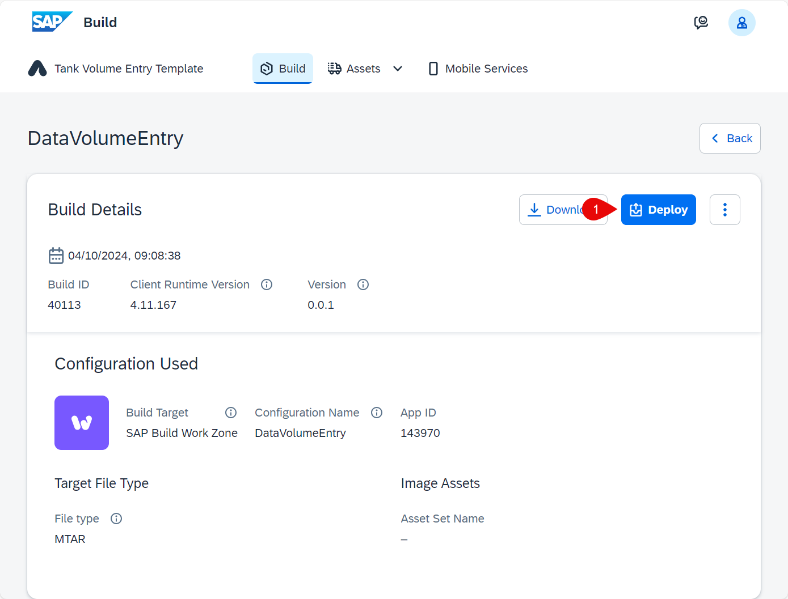
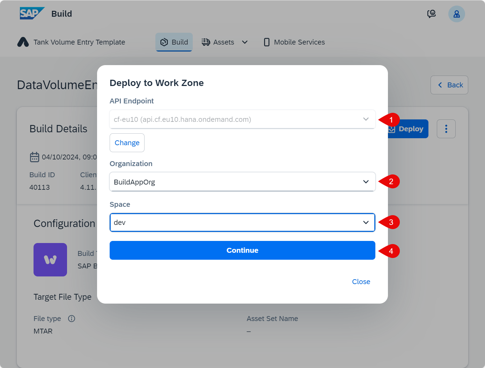
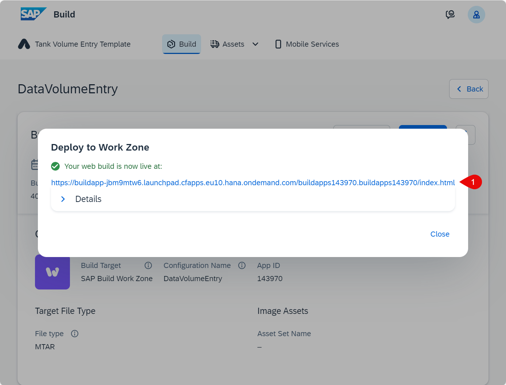
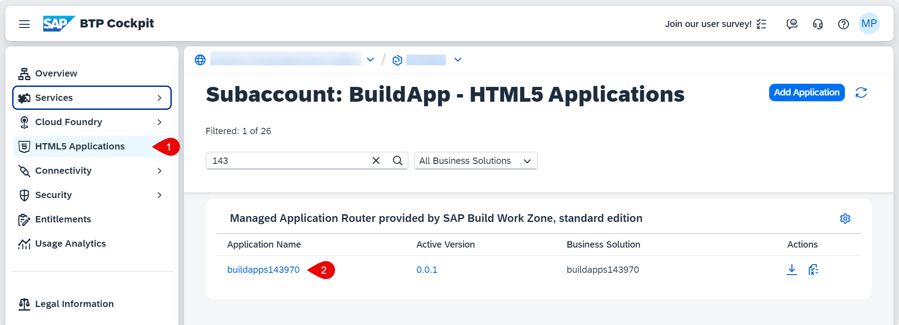

# Build and Deploy Your SAP Build Apps Application to SAP BTP

## Introduction

In this section you will build the application that you have created using SAP Build Apps, and then deploy it in SAP BTP as an HTML5 application.

## Build and Deploy the Application

1. In **SAP Build Apps**, choose **LAUNCH**.

2. Choose **OPEN BUILD SERVICE**.

   

3. Choose **Create Configuration**.

   

5. Choose **SAP Build Work Zone**.

   

6. Enter a name for the configuration, then choose **Create**.

   

7. Choose the build configuration, enter a version number (for example, **0.0.1**), then choose **Build**.

   

   The **Build History** section first shows the status **Created**. It will change to **Building** and finally **Delivered**.

8. Click on the **Delivered** line in the **Build History** to open the **Build Details**.

   

9. Choose **Deploy**.

   

10. Select the **API Endpoint** (you will need to authorize yourself using your identity provider the first time you do this.), **Organization** and **Space**, then choose **Continue**.

    

    The deployment starts. When it finishes, you will see a link to the application.

11. Click on the link to open the application.

    

     

## Check the Deployment

1. In the **SAP BTP cockpit**, navigate to your subaccount.

2. From the left-side subaccount menu, navigate to **HTML5 Applications**.

   In the **Managed Application Router provided by SAP Build Work Zone, standard edition** section, you will find a list of applications.

   

3. Click the **Application Name** (this will include the **App Id** from the build configuration).

   Your application opens. Depending on how your subaccount is configured, you might need to choose the identity provider and log in.

## Summary

You have deployed the application that you have developed in SAP Build Apps to SAP BTP as an HTML5 application that can be consumed using a URL.
