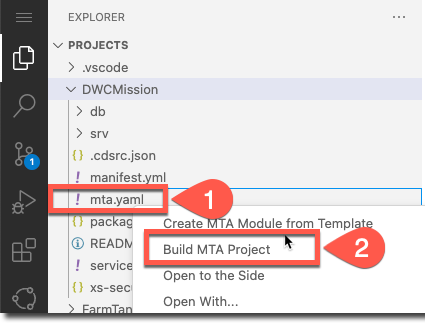
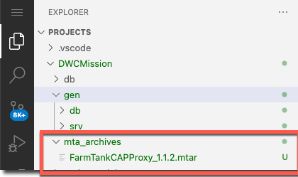
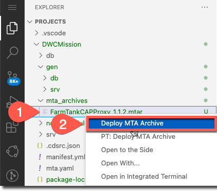
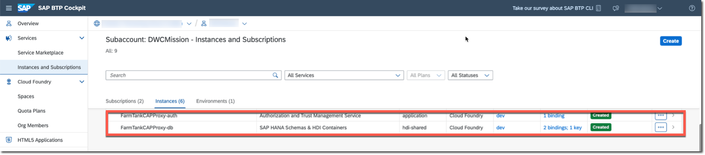
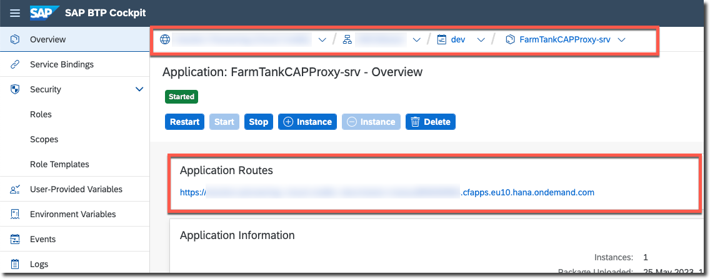
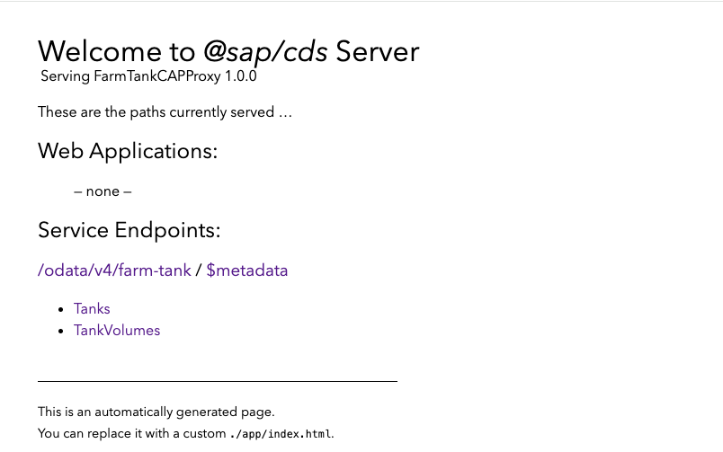

# Deploy the CAP Application Using SAP Business Application Studio

In this section, you will be deploying the CAP application to SAP BTP, Cloud Foundry environment.

Open the [CAP application](../create-cap-application/README.md) using SAP Business Application Studio.

## Log In to Cloud Foundry and Set Targets (Only required if not logged in yet)

1. Choose **Cloud Foundry** from the **Activity** bar.
2. Enter the **Cloud Foundry Sign In** details.
3. Choose the **Cloud Foundry Organization** and **Cloud Foundry Space**.
4. Choose **Apply**.

See [Cloud Foundry Tools](https://help.sap.com/docs/bas/sap-business-application-studio/cloud-foundry-tools).

## Preparation

Projects using CAP need to manage dependencies to the respective tools and libraries in their package.json. 

1. Open **Terminal** &rarr; **New Terminal**.

2. If you are not in the imported project folder already, go to it by entering **cd DWCMission**.

3. Enter **npx npm-check-updates -u**.

It provides a list of outdated packages along with the version to which they would be updated, updates the dependencies in your package.json file to the most recent versions, and makes the necessary changes to the package.json file.

4. Enter **npm install**.

The **package-lock.json** file in your project root freezes all dependencies and is deployed with your application. 

See [Lock Dependencies Before Deploying](https://cap.cloud.sap/docs/node.js/best-practices).

## Build and Deploy the CAP Application

1. Right click the **mta.yaml** file and choose **Build MTA Project**.

2. Make sure the build is completed and the MTAR file is created under **mta_archives**.

3. Right click the MTAR file under **mta_archives** and choose **Deploy MTA Archive**.

   Alernatively, you could build and deploy using the following commands too:
   1. Open **Terminal** &rarr; **New Terminal**.
   2. If you are not in the imported project folder already, go to it by entering **cd DWCMission**.
   3. Enter **mbt build -t gen --mtar mta.tar**.
   4. Enter **cf deploy gen/mta.tar --delete-services**.

4. Make sure the deployement is successful and availble in the SAP BTP cockpit.

5. In the SAP BTP cockpit, go to your subaccount and then to your space, and find the OData endpoint.

6. Choose the application route to view the service endpoint.

7. Make sure to use the user ID (field.technician@tester.sap.com) and password (initial) to access the endpoint.

See [Building and Deploying Multitarget Applications](https://help.sap.com/docs/bas/sap-business-application-studio/building-and-deploying-multitarget-applications)

## SAP BTP Destination Details

The SAP BTP application route above serves as the URL for defining [SAP BTP Destinations](../create-btp-destination/README.md#create-a-destination-on-sap-btp), enabling the SAP Build Apps application to access the SAP Datasphere data through it.

# Summary

You have successfully deployed your CAP application! As a result, you can now access the OData service exposed by this application. 
