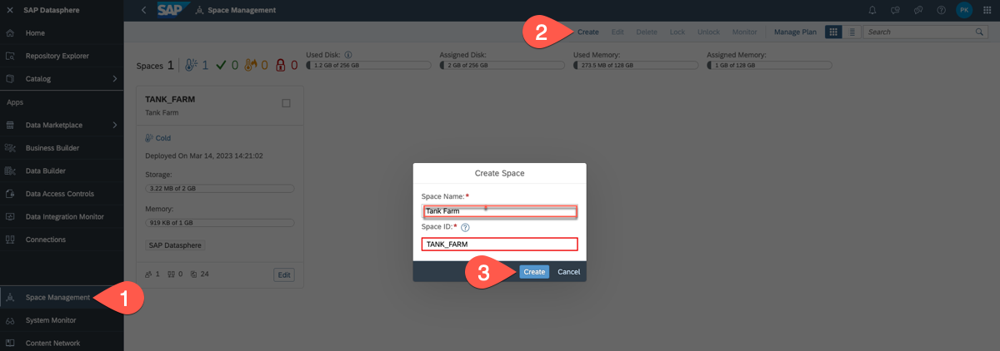

# Set Up SAP Datasphere

To set up SAP Datasphere, use the following resources:
* [Create Your SAP Datasphere Service Instance in SAP BTP](https://help.sap.com/docs/SAP_DATASPHERE/9f804b8efa8043539289f42f372c4862/54288aa4843c4856aba8333742a661ea.html) for Cloud Platform Enterprise Agreement or subscription type accounts in SAP BTP.
* [SAP Datasphere Trial](https://developers.sap.com/tutorials/data-warehouse-cloud-1-begin-trial.html) for SAP BTP free tier model with Pay-As-You-Go plan. 
* [Tutorial: Introduction to SAP Datasphere Administration](https://developers.sap.com/group.data-warehouse-cloud-administration-intro.html)

## Create and Set Up Space in SAP Datasphere

SAP Datasphere serves as the repository for master data, which is readily accessible to SAP Build Apps through a CAP application. The transactional data, entered via the SAP Build Apps application, complements the master data. Additionally, SAP Datasphere facilitates the creation of an analytical model, leveraging the master and transactional data, specifically designed for data analysis within SAP Analytics Cloud.

### Log In to SAP Datasphere

When you are added as a user to SAP Datasphere, you receive a welcome email. Choose **Activate Account** to connect to the server and set your password. The main panel of the SAP Datasphere Home screen gives you access to shortcuts to help you get started.

### Create Space

All data acquisition, preparation, and modeling happen inside spaces. A space is a secure area - space data cannot be accessed outside the space unless it is shared to another space or exposed for consumption.

1. In the side navigation area, choose **Space Management** and then choose **Create**.
2. In the **Space Name** field, enter a name for the space, for example **Tank Farm**.
3. In the **Space ID** field, enter an ID for the space, for example **TANK_FARM**.
    See [Create Space](https://help.sap.com/docs/SAP_DATASPHERE/9f804b8efa8043539289f42f372c4862/bbd41b82ad4d4d9ba91341545f0b37e7.html?locale=en-US).
4. Choose **Create**.

    
5. In the **Members** section, choose **+** to add users as members of this space.
6. Choose **Deploy** in the upper right corner to save and deploy your space to the database.
    See [Assign Members to Your Space](https://help.sap.com/docs/SAP_DATASPHERE/be5967d099974c69b77f4549425ca4c0/9d59fe511ae644d98384897443054c16.html?locale=en-US).
7. Once the space is created, it is listed in **Space Management**.

### Create Technical Database User

To access SAP Datasphere artifacts, which are exposed for consumption as sources from the CAP application, you must create a database user with the appropriate privileges, create a user-provided service in the SAP BTP cockpit, and configure your HDI project.

To create a database user, follow these steps:

1. In the side navigation area, choose  **Space Management**, locate your space tile, and choose **Edit** to open it.
2. In the **Database Users** section, choose **Create** to open the **Create Database User** dialog.
3. In the **Database User Name Suffix** field, enter **TECH_USER**.
4. Select the **Enable Read Access (SQL)** checkbox.
5. Select the **Enable HDI Consumption** checkbox. Choose **OK** in the confirmation dialog box if any.
6. Select the **Enable Write Access (SQL, DDL, & DML)** checkbox, if it is not selected already.
7. Choose **Create**.

    
8. Once the user is created, a message may pop up saying **Database User Created**.
    >**Note:** Recent activities can be viewed from the upper right corner menu **Notification** as well.
    
9. Choose **Deploy** in the upper right corner.
10. Once the deployement is completed, in the **Database Users** section, choose the info icon from the database user (FARM_TANK#TECH_USER) to open the **Database User Details** dialog.
11. In the **Password** section, choose **Request New Password**.
12. In the **HDI Consumption** section, choose **Copy Full Credentials**.
13. **IMPORTANT:** Store this copied info in secure place to use it later including the password.

See: 
* [Create a Database User](https://help.sap.com/docs/SAP_DATASPHERE/be5967d099974c69b77f4549425ca4c0/798e3fd6707940c3bd2219b2d1ebaac2.html?locale=en-US)
* [Tutorial: Create a Database User in SAP Datasphere](https://developers.sap.com/tutorials/data-warehouse-cloud-intro8-create-databaseuser.html)

### Enable SAP HANA Deployment Infrastructure (HDI) Mapping in the Space

The SAP HANA Deployment Infrastructure (HDI) uses containers to store design-time artifacts and the corresponding deployed run-time (catalog) objects. By deploying it into SAP HANA Cloud underneath the SAP Datasphere, you can write into SAP Datasphere space.

To enable the option to add an HDI Container into the SAP Datasphere space, follow these steps.

1. In the side navigation area, choose **Space Management**, locate your space tile (Tank Farm), and choose **Edit** to open it.

2. In the **HDI Container section**, if the + button is not available, then you need to raise a ticket following the dialog instruction.

This creates instance mapping between SAP BTP space and SAP Datasphere database. Since the mapping is tied to a particular SAP BTP space, it is necessary to create a unique mapping for each space in use. To create this mapping, you will be required to provide the ID of the SAP BTP Organization, Space ID, and SAP Datasphere tenant as essential details.

See: 
* [Add an HDI Container and Access its Objects in Your Space](https://help.sap.com/docs/SAP_DATASPHERE/be5967d099974c69b77f4549425ca4c0/5d55da5514b240ff8d3a970bf7dc6705.html)
* [Blog: Access SAP Datasphere Artifatcs](https://blogs.sap.com/2021/03/18/expose-sap-data-warehouse-cloud-artefacts-as-odata-v4-service/)

## Link SAP Datasphere and SAP Analytics Cloud

Linking SAP Datasphere and SAP Analytics Cloud makes easier to switch between these two products.

See [Enable the Product Switch to Access an SAP Analytics Cloud Tenant](https://help.sap.com/docs/SAP_DATASPHERE/9f804b8efa8043539289f42f372c4862/40db56764bff4f9ab7eace16ac8e7e67.html?locale=en-US).

You can find the linked products in the top right corner under the label **Product Switch**, allowing you to switch easily between them.

## Summary

With SAP Datasphere successfully set up, you can now proceed to prepare your CAP application to interact with it. You have the capability to both read from and write into SAP Datasphere using an HDI Container. This integration allows your CAP application to seamlessly access and manipulate data within the SAP Datasphere environment.
