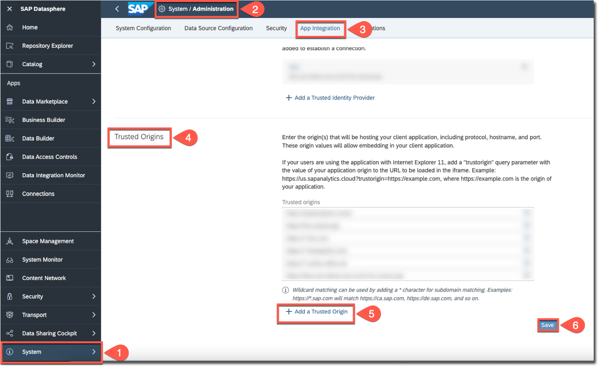
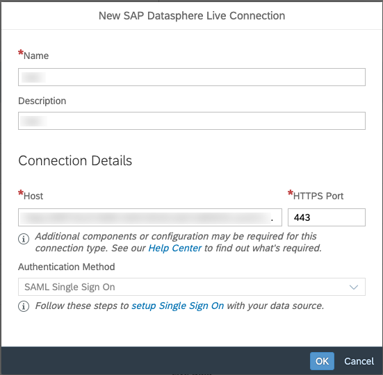

# Configure SAP Analytics Cloud

It is expected that you already have an SAP Analytical Cloud tenant and will be using it along with SAP Datasphere and SAP Build Apps from your account in SAP BTP.

You will be developing an SAP Analytical Cloud dashboard that utilizes the analytic model from SAP Datasphere to analyze the data. Before you start, you have to configure SAP Analytical Cloud to access the analytic model.

## Connect SAP Analytical Cloud with SAP Datasphere

To access the analytic model from SAP Datasphere, first you have to add the SAP Analytical Cloud system as a trusted origin in SAP Datasphere and live data connection needs to be created in the SAP Analytical Cloud tenant. 

### Add SAP Analytical Cloud as a Trusted Origin in SAP Datasphere 

1. Log in to your SAP Datasphere system as an administrator.
2. From the side navigation, choose **System**.
3. Choose **Administration** and then choose **App Integration**. 
4. In the **Trusted Origins** section, choose **Add a Trusted Origin**.
5. Add the URL of your SAP Analytics Cloud system.
6. Choose **Save**, and then choose **Deploy**.

### Create Live Data Connection to SAP Datasphere in SAP Analytics Cloud

1. Log in to your SAP Analytics Cloud system.
2. Choose **Connections**, and then choose **+** to open the **Select a data source** dialog.
3. Expand **Connect to Live Data** and choose **SAP Datasphere**.
4. Enter a name and a description for the connection.
5. Add your SAP Datasphere hostname which can be copied from the browser's address bar when logged in to your SAP Datasphere tenant and enter **443** in the **HTTPS Port** field.
6. Choose **OK** and you'll be prompted to log in to SAP Datasphere.
7. Enter a valid username and password for SAP Datasphere and choose **OK** to set up the connection.

See [Live Data Connections to SAP Datasphere](https://help.sap.com/docs/SAP_ANALYTICS_CLOUD/00f68c2e08b941f081002fd3691d86a7/ad4281e2875949f0b4d45d1072ff4c38.html?locale=en-US).

## Summary

You have successfully configured SAP Analytics Cloud to be able to analyze data by creating a dashboard after preparing the analytic model in SAP Datasphere.
